# 第一单元-走进化学世界 — 题库

> 来源：中考化学同步+一轮讲义 | 标注格式：TK-C9-U1-题序号

---

### TK-C9-U1-001
| 字段 | 内容 |
|------|------|
| 章节 | 第一单元-走进化学世界 |
| 来源 | 中考同步+一轮讲义 |
| 题型 | 填空题 |

**题目：** 下面是常见物质的性质和变化：A．酒精能挥发B．铁在潮湿的空气里生成铁锈C．水沸腾变成水蒸气D．二氧化碳能使澄清的石灰水变浑浊①属于物理变化的是(填写序号，下同)。②属于化学性质的是。

**答案：** ①C②D.

---

### TK-C9-U1-002
| 字段 | 内容 |
|------|------|
| 章节 | 第一单元-走进化学世界 |
| 来源 | 中考同步+一轮讲义 |
| 题型 | 选择题 |

**题目：** 下列变化属于化学变化的是（）A．海水晒盐B．风力发电C．树叶腐烂D．铁水铸锅

**答案：** C

---

### TK-C9-U1-003
| 字段 | 内容 |
|------|------|
| 章节 | 第一单元-走进化学世界 |
| 来源 | 中考同步+一轮讲义 |
| 题型 | 选择题 |

**题目：** 下列语言描述不涉及化学性质的是（）A．凡海盐，见水即化B．金入于猛火，色不夺精光 C．熬胆矾铁釜，久之亦化为铜D．凡煤炭普天皆生，以供煅炼金、石之用

**答案：** A

---

### TK-C9-U1-004
| 字段 | 内容 |
|------|------|
| 章节 | 第一单元-走进化学世界 |
| 来源 | 中考同步+一轮讲义 |
| 题型 | 填空题 |

**题目：** 自然界有一种“雷雨发庄稼”的现象，雷雨中发生的一系列化学反应如下：①空气中的氮气在放电条件下与氧气直接化合，生成无色且难溶于水的一氧化氮气体；②一氧化氮常温下就能与空气中的氧气反应，生成红棕色的二氧化氮气体；③二氧化氮与水反应，生成硝酸和一氧化氮；④生成的硝酸随雨水淋洒到大地上，与土壤中的矿物作用，生成可溶于水的硝酸盐。请根据以上叙述填空：(1)一氧化氮的物理性质有(填写两条)：。

**答案：** (1)无色、气体、难溶于水(任选两条)；

---

### TK-C9-U1-005
| 字段 | 内容 |
|------|------|
| 章节 | 第一单元-走进化学世界 |
| 来源 | 中考同步+一轮讲义 |
| 题型 | 选择题 |

**题目：** 下列诗句或俗语中，涉及化学反应的是（）A．吹尽黄沙始见金B．爝火燃回春浩浩C．酒香不怕巷子深D．铁杵磨成绣花针

**答案：** B

---

### TK-C9-U1-006
| 字段 | 内容 |
|------|------|
| 章节 | 第一单元-走进化学世界 |
| 来源 | 中考同步+一轮讲义 |
| 题型 | 选择题 |

**题目：** 如图所示，为防止燃气泄漏造成危险，可在食堂或家庭中安装报警器。下列燃气的性质中，能确定安装报警器位置的是（）A．毒性B．密度C．气味D．溶解性
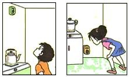

**答案：** B

---

### TK-C9-U1-007
| 字段 | 内容 |
|------|------|
| 章节 | 第一单元-走进化学世界 |
| 来源 | 中考同步+一轮讲义 |
| 题型 | 选择题 |

**题目：** 下列对一氧化碳性质的描述，属于化学性质的是（）A．常温下为无色、无味的气体B．极难溶于水C．相同状况下，密度比空气略小 D．具有可燃性

**答案：** D

---

### TK-C9-U1-008
| 字段 | 内容 |
|------|------|
| 章节 | 第一单元-走进化学世界 |
| 来源 | 中考同步+一轮讲义 |
| 题型 | 填空题 |

**题目：** 选择仪器下方的字母填写在相应横线上：(1)用来吸取和滴加少量液体的仪器是； (2)可以直接加热的仪器是；(3)用作量度一定量液体体积的仪器是； (4)实验室常用的加热仪器是。

**答案：** (1)g； (2)d； (3)c； (4)h.

---

### TK-C9-U1-009
| 字段 | 内容 |
|------|------|
| 章节 | 第一单元-走进化学世界 |
| 来源 | 中考同步+一轮讲义 |
| 题型 | 选择题 |

**题目：** 在下列仪器中，可用于配制溶液、加热较多量液体及反应容器的是（ ） A．试管B．烧杯C．集气瓶    D．量筒

**答案：** B

---

### TK-C9-U1-010
| 字段 | 内容 |
|------|------|
| 章节 | 第一单元-走进化学世界 |
| 来源 | 中考同步+一轮讲义 |
| 题型 | 填空题 |

**题目：** 判断下列实验操作是否正确，如果不正确请指出操作错误的地方。①加热液体②称取氯化钠固体③取少量液体④滴加液体⑤点燃酒精灯⑥量取液体⑦点燃酒精灯⑧闻药品气味⑨熄灭酒精灯⑩取固体药品➃加入块状固体⑫粉末的取用⑬浓硫酸的稀释⑭给固体加热⑮溶解氯化钠⑯检查气密性➃塞紧橡皮塞⑱连接仪器⑲振荡液体⑳固体药品的保存
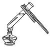

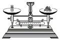

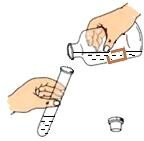

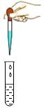

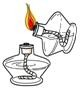

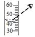

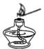

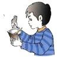

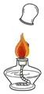

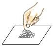

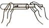

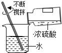

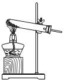

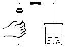

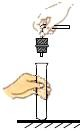

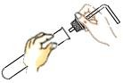

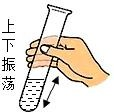

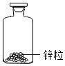

**答案：** ①错误，试管内的液体不能超过容积的 1/3；②称量固体时应“左物右码”；③错误，倾倒液体时瓶口要紧挨试管口，瓶盖要倒放；④正确；⑤错误，点燃酒精灯时禁止用一酒精灯去引燃另一酒精灯；⑥错误，量筒读数时应平视刻线；⑦正确；⑧正确；⑨正确；⑩应用药匙取用粉末状药品；➃应一横二放三慢立；⑫正确；⑬正确；⑭正确；⑮量筒不能用作溶解药品的仪器；⑯正确；➃错误，把橡皮塞慢慢转动着塞进试管口，切不可把试管放在桌上再使劲塞进塞子，以免压破试管；⑱正确；⑲错误，振荡试管时，振荡试管中的液体的正确方法是手指拿住试管，用手腕的力量左右摆动，而不是手指拿住试管上下晃动；⑳错误，固体药品，应保存在广口瓶中

---

### TK-C9-U1-011
| 字段 | 内容 |
|------|------|
| 章节 | 第一单元-走进化学世界 |
| 来源 | 中考同步+一轮讲义 |
| 题型 | 填空题 |

**题目：** 下列实验操作中错．误．的是()。
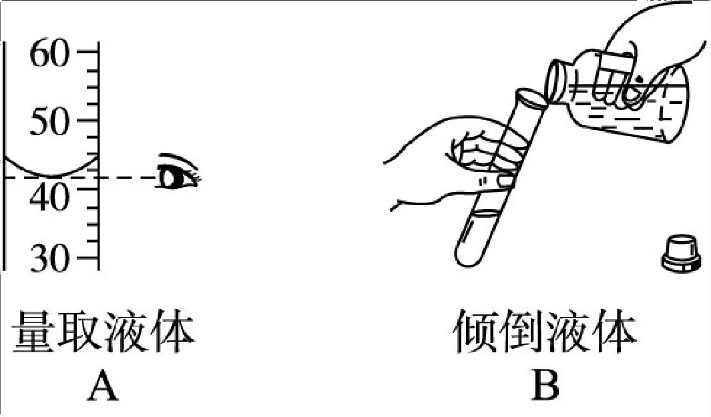

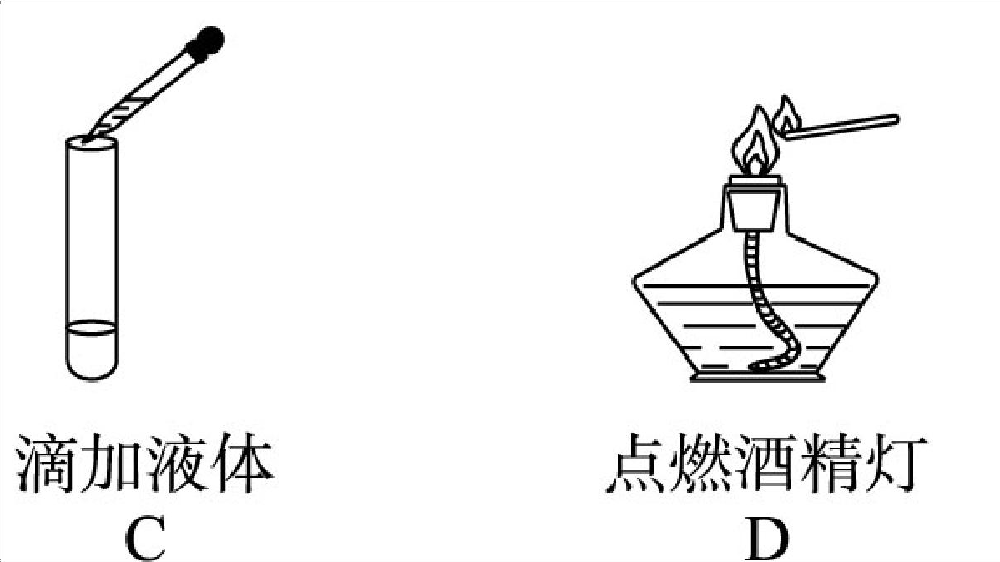

**答案：** C.

---

### TK-C9-U1-012
| 字段 | 内容 |
|------|------|
| 章节 | 第一单元-走进化学世界 |
| 来源 | 中考同步+一轮讲义 |
| 题型 | 选择题 |

**题目：** 量取液体并加热，下列实验操作不正确的是（）A．倾倒B．滴加C．读数D．加热
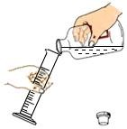

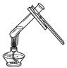

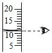

**答案：** A

---

### TK-C9-U1-013
| 字段 | 内容 |
|------|------|
| 章节 | 第一单元-走进化学世界 |
| 来源 | 中考同步+一轮讲义 |
| 题型 | 选择题 |

**题目：** 使用容量规格 XmL 的量筒量取液体，如图为量取时的实际情景（只画出有关片段），则所量取的液体体积读数应为（ ）a  bA、（b+0.1）mLB、（b 1) mL5C、( a - b  b) mLD、（b+0.2）mL10
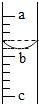

**答案：** B.

---

### TK-C9-U1-014
| 字段 | 内容 |
|------|------|
| 章节 | 第一单元-走进化学世界 |
| 来源 | 中考同步+一轮讲义 |
| 题型 | 填空题 |

**题目：** 某学生用量筒量取液体时，量筒放平稳后仰视液面读得数值为 19 mL，倾倒部分液体后，又俯视液面，读得数值为 10 mL。则该学生实际倾倒的液体体积是()。A．9 mLB．小于 9 mLC．大于 9 mLD．无法判断

**答案：** C.

---

### TK-C9-U1-015
| 字段 | 内容 |
|------|------|
| 章节 | 第一单元-走进化学世界 |
| 来源 | 中考同步+一轮讲义 |
| 题型 | 选择题 |

**题目：** 酸碱中和反应实验多处使用滴管，下列操作正确的是（ ）A. 滴加酚酞B. 放置滴C. 取用盐酸D. 搅拌溶液化学是一门以实验为基础的科学。下列仪器用途不正确的是（）下列常用化学仪器没有刻度的是（）A．试管B．天平C．量筒D．温度计 18.下列实验操作正确的是（）A．闻气体气味B．氧气验满C．取用固体粉末D．滴加液体19.请你分析如图图示的操作可导致的后果：图 1；图 2。
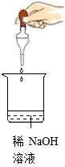

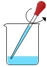

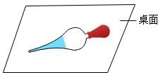

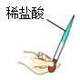

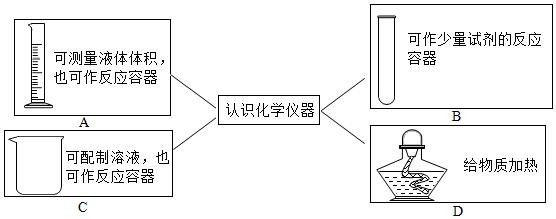

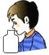

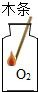

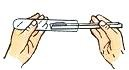

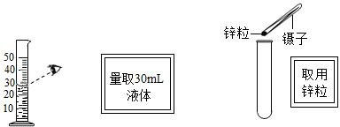

**答案：** A

---

## 题目数量统计
| 来源 | 题目数 |
|------|--------|
| 中考同步+一轮讲义 | 15 |
| 合计 | 15 |
