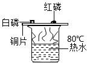
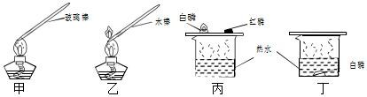
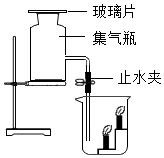
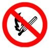
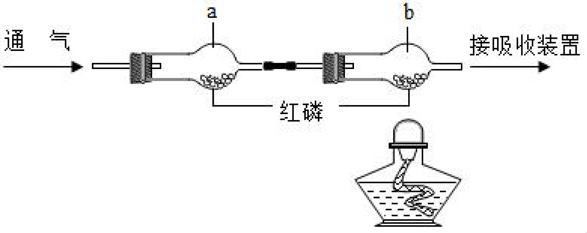
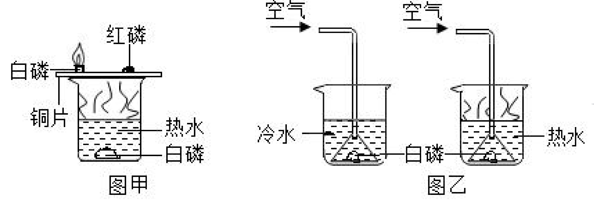
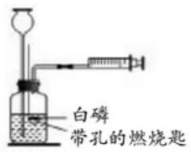
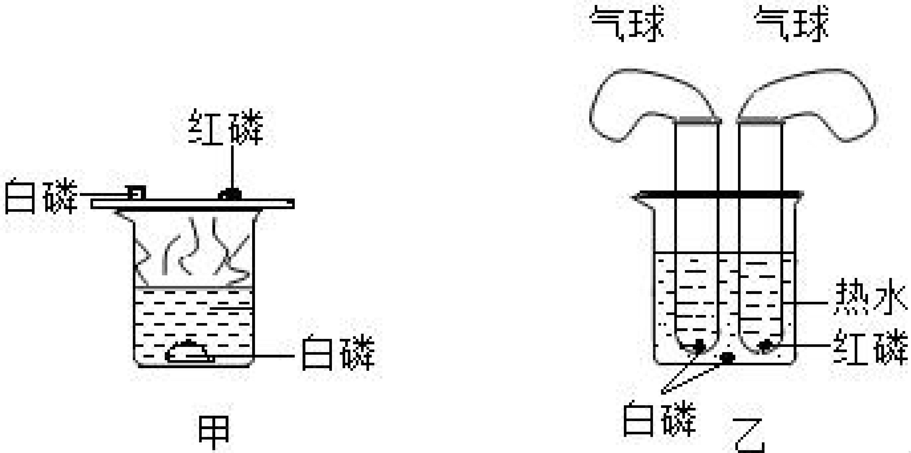
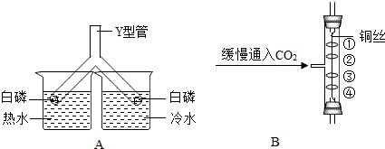

# 第七单元-能源的合理利用与开发 — 题库

> 来源：中考化学同步+一轮讲义 | 标注格式：TK-C9-U7-题序号

---

### TK-C9-U7-001
| 字段 | 内容 |
|------|------|
| 章节 | 第七单元-能源的合理利用与开发 |
| 来源 | 中考同步+一轮讲义 |
| 题型 | 选择题 |

**题目：** 下列所采取的安全措施不正确的是 A．油锅起火迅速用锅盖盖灭B．煤气泄漏迅速打开排气扇C．酒精灯不慎打翻起火，迅速用湿抹布扑盖D．在森林大火蔓延路线前开辟一条“隔离带”，以控制火灾

**答案：** B

---

### TK-C9-U7-002
| 字段 | 内容 |
|------|------|
| 章节 | 第七单元-能源的合理利用与开发 |
| 来源 | 中考同步+一轮讲义 |
| 题型 | 选择题 |

**题目：** 下列关于燃烧与灭火的说法，正确的是()A．放在空气中的木桌椅没有燃烧，是因为木桌椅不是可燃物 B．防止森林大火蔓延，开挖隔离带，是为了将可燃物与火隔离 C．油锅着火，用锅盖盖上，是为了降低可燃物的温度D．住房失火，消防队员用水扑灭，是为了降低可燃物的着火点

**答案：** B.

---

### TK-C9-U7-003
| 字段 | 内容 |
|------|------|
| 章节 | 第七单元-能源的合理利用与开发 |
| 来源 | 中考同步+一轮讲义 |
| 题型 | 选择题 |

**题目：** 用如图所示装置探究燃烧的条件，有关该实验的说法正确的是（）A．该实验使用了相同的可燃物B．该实验只能得出燃烧需要氧气这一结论C．该实验的现象是铜片上的白磷不燃烧，红磷燃烧 D．该实验说明燃烧需要使温度达到可燃物的着火点

**答案：** D

---

### TK-C9-U7-004
| 字段 | 内容 |
|------|------|
| 章节 | 第七单元-能源的合理利用与开发 |
| 来源 | 中考同步+一轮讲义 |
| 题型 | 选择题 |

**题目：** 森林火灾扑救的方法有飞机吊桶投水、砍出隔离带、人工扑打等。其中“飞机吊桶投水”采用的主要灭火原理是（）A．隔绝氧气B．降低可燃物的着火点 C．隔离可燃物D．降低温度至可燃物的着火点以下

**答案：** D

---

### TK-C9-U7-005
| 字段 | 内容 |
|------|------|
| 章节 | 第七单元-能源的合理利用与开发 |
| 来源 | 中考同步+一轮讲义 |
| 题型 | 选择题 |

**题目：** 下列有关燃烧和灭火的说法不正确的是（）A．燃烧是一种缓慢的氧化反应B．“釜底抽薪”蕴含的灭火原理是清除可燃物C．温度达到着火点，可燃物不一定燃烧D．篝火晚会时架空火柴，有利于木材充分燃烧

**答案：** A

---

### TK-C9-U7-006
| 字段 | 内容 |
|------|------|
| 章节 | 第七单元-能源的合理利用与开发 |
| 来源 | 中考同步+一轮讲义 |
| 题型 | 选择题 |

**题目：** 从环境保护的角度考虑，下列燃料中最理想的是（）A．煤B．汽油C．氢气D．天然气

**答案：** C

---

### TK-C9-U7-007
| 字段 | 内容 |
|------|------|
| 章节 | 第七单元-能源的合理利用与开发 |
| 来源 | 中考同步+一轮讲义 |
| 题型 | 选择题 |

**题目：** 下列灭火方法正确的是（）A．电器着火，用水浇灭B．酒精灯打翻着火，用湿抹布扑灭C．室内起火，开窗通风D．炒菜时油锅着火，用灭火器扑灭

**答案：** B

---

### TK-C9-U7-008
| 字段 | 内容 |
|------|------|
| 章节 | 第七单元-能源的合理利用与开发 |
| 来源 | 中考同步+一轮讲义 |
| 题型 | 选择题 |

**题目：** 有关燃烧和灭火的说法中正确的是（）A．用嘴吹灭蜡烛—隔绝氧气B．木柴架空—增大了氧气浓度C．森林着火开辟隔离带—清除可燃物D．煤炉火越扇越旺—增大与氧气的接触面积

**答案：** C

---

### TK-C9-U7-009
| 字段 | 内容 |
|------|------|
| 章节 | 第七单元-能源的合理利用与开发 |
| 来源 | 中考同步+一轮讲义 |
| 题型 | 选择题 |

**题目：** 探究燃烧的条件，有利于人们更好的利用燃烧为我们的生活及社会发展服务。下列对比实验设计与所研究的条件，对应关系不正确的是（）A．甲和乙：可燃物 B．丙和丁：氧气C．乙和丁：温度达到着火点 D．丙：温度达到着火点

**答案：** C

---

### TK-C9-U7-010
| 字段 | 内容 |
|------|------|
| 章节 | 第七单元-能源的合理利用与开发 |
| 来源 | 中考同步+一轮讲义 |
| 题型 | 选择题 |

**题目：** 小科为了验证 CO2 密度比空气大，采用如图所示装置进行实验。集气瓶中充满 CO2，大烧杯中放置着两支高低不等的点燃的蜡烛，实验时打开止水夹，移开玻璃片。下列说法正确的是（    ）A．移开玻璃片的目的是缩短实验时间B．观察到高的蜡烛先熄灭，低的蜡烛后熄灭 C．蜡烛会熄灭是因为 CO2 降低了蜡烛的着火点D．导管插入到大烧杯底部比插在两蜡烛之间要严谨

**答案：** D

---

### TK-C9-U7-011
| 字段 | 内容 |
|------|------|
| 章节 | 第七单元-能源的合理利用与开发 |
| 来源 | 中考同步+一轮讲义 |
| 题型 | 选择题 |

**题目：** “安全重于泰山”。以下应张贴在“防火”场所的标志是（）A．B．C．D．

**答案：** A

---

### TK-C9-U7-012
| 字段 | 内容 |
|------|------|
| 章节 | 第七单元-能源的合理利用与开发 |
| 来源 | 中考同步+一轮讲义 |
| 题型 | 选择题 |

**题目：** 了解化学安全知识，增强安全防范意识。下列做法不符合安全要求的是（）①发现煤气泄漏，立即打开排气扇②加油站，面粉厂等地严禁烟火③炒菜时油锅起火，立即用锅盖盖灭④为防止煤气中毒，室内用煤炉取暖时保证烟囱畅通⑤高楼住宅发生火灾时，若楼内有电梯，则迅速使用电梯逃生A．①③B．①⑤C．②③④D．①③⑤

**答案：** B。

---

### TK-C9-U7-013
| 字段 | 内容 |
|------|------|
| 章节 | 第七单元-能源的合理利用与开发 |
| 来源 | 中考同步+一轮讲义 |
| 题型 | 选择题 |

**题目：** 依据如图所示的实验装置进行实验，实验过程如下：①通入 N2，点燃酒精灯，一段时间后，a、b 中均无明显现象②改通 O2 片刻，熄灭酒精灯后，b 中红磷燃烧。下列说法错误的是（    ）A．实验①能说明 N2 不支持燃烧B．实验①可以改用 CO2 进行实验C．只从实验②就可以得到可燃物燃烧需要氧气D．实验①②对照，能得出可燃物燃烧需要的条件

**答案：** C。点燃

---

### TK-C9-U7-014
| 字段 | 内容 |
|------|------|
| 章节 | 第七单元-能源的合理利用与开发 |
| 来源 | 中考同步+一轮讲义 |
| 题型 | 填空题 |

**题目：** 依据如图进行实验(夹持仪器略去)。实验过程：①通入 N2，点燃酒精灯，一段时间后，a、b  中均无明显现象；②熄灭酒精灯，立即改通 O2，a 中无明显现象，b 中红磷燃烧。实验过程②中，红磷燃烧的化学方程式为。实验过程②中，对比 a、b  中的实验现象，可知可燃物燃烧的条件之一是。实验过程中，能说明可燃物燃烧需要氧气的实验是。

**答案：** (1) 4P＋5O2=====2P2O5；(2)燃烧需要温度达到可燃物的着火点；(3)步骤①中 b通 N2 不燃烧，步骤②中 b 通 O2 燃烧.

---

### TK-C9-U7-015
| 字段 | 内容 |
|------|------|
| 章节 | 第七单元-能源的合理利用与开发 |
| 来源 | 中考同步+一轮讲义 |
| 题型 | 填空题 |

**题目：** 图甲和图乙所示实验方法均可用来探究可燃物燃烧的条件。某同学用图甲所示装置进行实验，观察到的现象是。另一同学用图乙所示装置进行实验，得到以下实验事实：①不通空气时，冷水中的白磷不燃烧； ②通空气时，冷水中的白磷不燃烧；③不通空气时，热水中的白磷不燃烧； ④通空气时，热水中的白磷燃烧。该实验中，能证明可燃物通常需要接触空气才能燃烧的实验事实是（填序号，下同）；能证明可燃物必须达到一定温度（着火点）才能燃烧的事实是。“化学实验的绿色化”要求实验室的“三废”排放降低到最低温度，并能得到妥善处理，实验室的安全性和环境质量得到提升，师生的绿色化学和环保意识得到强化。图甲和图乙所示实验相比，（填“甲”

**答案：** 铜片上的白磷燃烧，产生大量白烟，铜片上的红磷和热水中的白磷不燃烧③④乙点燃

---

### TK-C9-U7-016
| 字段 | 内容 |
|------|------|
| 章节 | 第七单元-能源的合理利用与开发 |
| 来源 | 中考同步+一轮讲义 |
| 题型 | 填空题 |

**题目：** 用如图所示装置探究可燃物的燃烧条件。实验过程如下：①将白磷放在燃烧匙内，塞好胶塞；②从长颈漏斗向瓶内迅速注入 60 ℃的水至刚刚浸没白磷；③连接好注射器，向瓶内推入空气，瓶内水面下降，当白磷露出水面时立即燃烧，停止推入空气；④白磷熄灭后，瓶内水面上升，最后淹没白磷。请回答下列问题：白磷燃烧的化学方程式为。对比③中白磷露出水面前、后的现象，说明燃烧需要的条件是。④中瓶内水面上升的原因是。

**答案：** (1)4P＋5O2=====2P2O5；(2)氧气(或空气)；(3)瓶内气体压强减小.

---

### TK-C9-U7-017
| 字段 | 内容 |
|------|------|
| 章节 | 第七单元-能源的合理利用与开发 |
| 来源 | 中考同步+一轮讲义 |
| 题型 | 填空题 |

**题目：** 小明在观察课本实验“燃烧的条件”（如图甲所示）时，对产生的大量白烟产生了疑问。于是查阅资料：…产物是白色固体﹣﹣五氧化二磷。五氧化二磷会刺激人体呼吸道，在空气中可能与水蒸气反应，生成一种剧毒物质﹣﹣HPO3（偏磷酸）。由小明查阅的资料看，他最初的疑问可能是：。分析：五氧化二磷和偏磷酸都会伤害人的身体，应对此实验进行改进。【实验改进】小明与同学一起对课本实验进行了如下的改进（如图乙所示）：去掉铜片，将足量的红磷和白磷分别放在两个大试管中，试管口各自套一个瘪气球，用线固定。然后将两只大试管同时浸在盛有热水的烧杯中。【观察现象】可观察到试管中，此反应的化学方程式为；气球的变化是：。【得出结论】

**答案：** 产生的白烟扩散到空气中对人体有害吗。点燃白磷剧烈地燃烧，产生大量白烟；4P+5O2====2P2O5；先膨胀后慢慢缩小，最后倒吸入试管中。与氧气接触，温度达到可燃物的着火点。能够防止生成的五氧化二磷扩散到空气中污染环境。水面上升至距试管口大约五分之一处；测定空气中氧气的含量。

---

### TK-C9-U7-018
| 字段 | 内容 |
|------|------|
| 章节 | 第七单元-能源的合理利用与开发 |
| 来源 | 中考同步+一轮讲义 |
| 题型 | 填空题 |

**题目：** 控制变量法是科学实验中的重要方法．下列两个实验的设计均运用了控制变量的方法．A 是探究燃烧条件的实验．实验中观察到浸在（填“热水”或“冷水”）里的 Y 型管中白磷燃烧；该实验中控制的变量是．B 是探究二氧化碳性质的实验．图中①、④为用紫色石蕊溶液润湿的棉球，②、③为用石蕊溶液染成紫色的干燥棉球．能说明 CO2 密度大于空气且能与水反应的现象为．+

**答案：** (1)热水；温度；(2)④比①先变红，②、③不变红．

---

## 题目数量统计
| 来源 | 题目数 |
|------|--------|
| 中考同步+一轮讲义 | 18 |
| 合计 | 18 |
