# 第三单元-物质构成的奥秘 — 题库

> 来源：中考化学同步+一轮讲义 | 标注格式：TK-C9-U3-题序号

---

### TK-C9-U3-001
| 字段 | 内容 |
|------|------|
| 章节 | 第三单元-物质构成的奥秘 |
| 来源 | 中考同步+一轮讲义 |
| 题型 | 填空题 |

**题目：** 氢元素（H）与汞元素（Hg）的本质区别是A．质子数不同B．元素符号不同C．氢元素是非金属元素，汞元素是金属元素D．相对原子质量不同

**答案：** A

---

### TK-C9-U3-002
| 字段 | 内容 |
|------|------|
| 章节 | 第三单元-物质构成的奥秘 |
| 来源 | 中考同步+一轮讲义 |
| 题型 | 选择题 |

**题目：** 下列叙述中正确的是()A.  高锰酸钾和锰酸钾是由同种元素组成的同种物质B.  白磷和红磷是由磷元素组成的两种不同物质C. P2O5 表示该物质是由 2 个磷原子和 5 个氧原子构成的D. CuSO4 是由 Cu、S 和 O 三个元素组成的

**答案：** B.

---

### TK-C9-U3-003
| 字段 | 内容 |
|------|------|
| 章节 | 第三单元-物质构成的奥秘 |
| 来源 | 中考同步+一轮讲义 |
| 题型 | 填空题 |

**题目：** 喝牛奶可以补钙，这里的“钙”指的是A．元素B．原子C．单质D．分子

**答案：** A

---

### TK-C9-U3-004
| 字段 | 内容 |
|------|------|
| 章节 | 第三单元-物质构成的奥秘 |
| 来源 | 中考同步+一轮讲义 |
| 题型 | 选择题 |

**题目：** 大家都想有一口洁白美丽的牙齿，但有时遇到蛀牙需要修复较好的方法是安装牙套。二氧化锆具有良好半透明外观、密度和强度很高，是目前最流行的牙套材料。锆元素在元素周期表中的信息如图所示。下列叙述错误的是A．锆属于金属元素B．锆原子中的核外电子数为 40C．锆的相对原子质量是 91.22D．锆原子中的中子数是 40
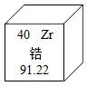

**答案：** D

---

### TK-C9-U3-005
| 字段 | 内容 |
|------|------|
| 章节 | 第三单元-物质构成的奥秘 |
| 来源 | 中考同步+一轮讲义 |
| 题型 | 选择题 |

**题目：** 如图摘自元素周期表，据此判断下列叙述错误的是A．氟的相对原子质量为 19.00B．氧原子的核外电子数为 8 C．氧和氟都属于非金属元素D．氧和氟位于元素周期表同一族
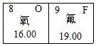

**答案：** D

---

### TK-C9-U3-006
| 字段 | 内容 |
|------|------|
| 章节 | 第三单元-物质构成的奥秘 |
| 来源 | 中考同步+一轮讲义 |
| 题型 | 选择题 |

**题目：** 下列各组元素的原子结构示意图中，具有相似化学性质的一组元素是（）A．          B．C．D．
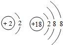

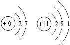

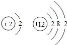

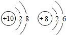

**答案：** A.

---

### TK-C9-U3-007
| 字段 | 内容 |
|------|------|
| 章节 | 第三单元-物质构成的奥秘 |
| 来源 | 中考同步+一轮讲义 |
| 题型 | 选择题 |

**题目：** A、B、C、D 是 1-18 号元素，A、B 元素的阳离子和 C、D 元素的阴离子都具有相同的电子层结构、且 B 元素原子的最外层电子数比 A 元素原子的最外层电子数少，C 的阴离子所带的负电荷多，则它们的核电荷数大小关系是（ ）A、A 大于 B 大于 D 大于 CB、C 大于 B 大于 A 大于 D C、A 大于 B 大于 C 大于 DD、B 大于 A 大于 C 大于 D

**答案：** A.

---

### TK-C9-U3-008
| 字段 | 内容 |
|------|------|
| 章节 | 第三单元-物质构成的奥秘 |
| 来源 | 中考同步+一轮讲义 |
| 题型 | 填空题 |

**题目：** “化学”一词最早出于清朝的《化学鉴原》一书，该书把地壳中含量第二的元素翻译成“矽（xi）”，如今把这种“矽”元素命名为A．硒 B．硅 C．铝 D．锡

**答案：** B

---

### TK-C9-U3-009
| 字段 | 内容 |
|------|------|
| 章节 | 第三单元-物质构成的奥秘 |
| 来源 | 中考同步+一轮讲义 |
| 题型 | 填空题 |

**题目：** 下列表示地壳中元素含量示意图的是ABCD
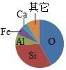

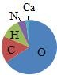

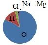

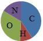

**答案：** A

---

### TK-C9-U3-010
| 字段 | 内容 |
|------|------|
| 章节 | 第三单元-物质构成的奥秘 |
| 来源 | 中考同步+一轮讲义 |
| 题型 | 填空题 |

**题目：** 元素周期表是学习研究化学的重要工具，根据下图，下列 6  种说法正确的有①碘的相对原子质量为 126.9g②碘原子核内质子数为 53③碘原子核外共有 53 个电子④碘元素属于非金属元素⑤碘原子在化学反应中容易失去电子⑥碘单质(I2)是由碘原子直接构成的A．2 种B．3 种C．4 种D．5 种
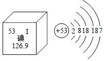

**答案：** B

---

### TK-C9-U3-011
| 字段 | 内容 |
|------|------|
| 章节 | 第三单元-物质构成的奥秘 |
| 来源 | 中考同步+一轮讲义 |
| 题型 | 选择题 |

**题目：** 加碘盐是在食盐中加入一定量的碘酸钾(K1O3)，其中碘元素在周期表中的信息及碘原子的结构示意图如图所示，下列说法正确的是A．碘元素是金属元素B．碘原子的质子数是 53C．图中 n 的值为 5D．碘原子在反应中一般较易失去电子
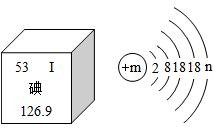

**答案：** B

---

### TK-C9-U3-012
| 字段 | 内容 |
|------|------|
| 章节 | 第三单元-物质构成的奥秘 |
| 来源 | 中考同步+一轮讲义 |
| 题型 | 选择题 |

**题目：** 关于一种原子形成离子前后的说法中，完全正确的是（）①一定显电性②最外层电子数一定改变③电子层数一定改变④元素的化学性质一定改变⑤核电荷数一定改变A．①③④⑤B．②③⑤C．①②④D．①②③④⑤

**答案：** C

---

### TK-C9-U3-013
| 字段 | 内容 |
|------|------|
| 章节 | 第三单元-物质构成的奥秘 |
| 来源 | 中考同步+一轮讲义 |
| 题型 | 选择题 |

**题目：** “芯片”是电子产品的核心部件，氮化镓是制造芯片的材料之一，如图是镓元素（Ga）的原子结构示意图及元素周期表的一部分。下列说法不正确的是A．镓属于金属元素，m=3B．镓化学性质比较活泼，易形成阳离子 Ga+3C．镓元素的位置应该在 Z 处D．镓的最外层电子数与 A1 相同

**答案：** B14、【答案】C15、【答案】C

---

### TK-C9-U3-014
| 字段 | 内容 |
|------|------|
| 章节 | 第三单元-物质构成的奥秘 |
| 来源 | 中考同步+一轮讲义 |
| 题型 | 选择题 |

**题目：** 锌是促进人体生长发育的必须微量元素。图甲为锌元素在元素周期表中的相关信息、图乙为锌原子结构示意图。下列说法正确的是A．锌属于非金属元素B．锌的相对原子质量为 65.38gC．锌原子的质子数为 30D．锌原子在化学反应中易得到电子15、1952 年人类首次发现了元素锿。锿入驻元素周期表已经快 70 年了，但由于研究困难，研究人员在 2021 年 2 月才首次揭示了锿的基本化学性质，锿的相关信息如图所示，下列有关镶元素的说法正确的是A．属于非金属元素B．相对原子质量是 252gC．原子核外有 99 个电子D．元素符号为 ES
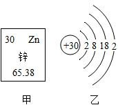

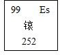

**答案：** C

---

### TK-C9-U3-015
| 字段 | 内容 |
|------|------|
| 章节 | 第三单元-物质构成的奥秘 |
| 来源 | 中考同步+一轮讲义 |
| 题型 | 选择题 |

**题目：** 华为 5G 技术，世界领先，芯片居功至伟。芯片的制造离不开硅元素，结合下图，下列有关硅元素的说法错误的是A．原子序数为 14 B．属于金属元素C．硅原子位于周期表的第三周期 D．相对原子质量为 28.0917、2005   年，巴里·马歇尔与罗宾·沃伦发现了幽门螺杆菌，获得诺贝尔生理学或医学奖。碳 14  呼气试验是临床用于检测幽门螺杆菌感染的一种方法，完成下列填空。原子种类质子数中子数相对原子质量C14614C126612碳 12 和碳 14 都称为碳元素的依据是。

**答案：** B

---

### TK-C9-U3-016
| 字段 | 内容 |
|------|------|
| 章节 | 第三单元-物质构成的奥秘 |
| 来源 | 中考同步+一轮讲义 |
| 题型 | 填空题 |

**题目：** 写出对应的元素名称或符号：Ca；I；Mg；汞；铂；氦。

**答案：** 钙；碘；镁；Hg；Pt；He

---

### TK-C9-U3-017
| 字段 | 内容 |
|------|------|
| 章节 | 第三单元-物质构成的奥秘 |
| 来源 | 中考同步+一轮讲义 |
| 题型 | 填空题 |

**题目：** 写出下列你熟悉的名称或符号。（请注意：大小写字母或汉字不能有错别字）氢碳氯氮PSNaO

**答案：** 磷；硫；钠；氧；H；C；Cl；N

---

### TK-C9-U3-018
| 字段 | 内容 |
|------|------|
| 章节 | 第三单元-物质构成的奥秘 |
| 来源 | 中考同步+一轮讲义 |
| 题型 | 填空题 |

**题目：** 写出下列元素符号：铁、氯、镁、钠、磷、硫、氧、铝、钾、铜元素名称钠镁铝硅磷硫氯氩元素符号NaMgAlSiPSClAr原子结构示意图

**答案：** Fe；Cl；Mg；Na；P；S；O；Al；K；Cu

---

### TK-C9-U3-019
| 字段 | 内容 |
|------|------|
| 章节 | 第三单元-物质构成的奥秘 |
| 来源 | 中考同步+一轮讲义 |
| 题型 | 填空题 |

**题目：** 下表为元素周期表中某_周期元素的原子结构示意图。请回答下列问题：元素名称钠镁铝硅磷硫氯氩元素符号NaMgAlSiPSClAr原子结构示意图表中磷原子的核电荷数 x=。表中具有相对稳定结构的元素是。在化学反应中，每个铝原子失去个电子形成铝离子。 (4)镁元素与氯元素形成的化合物化学式为。

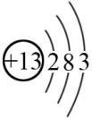

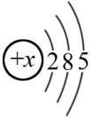

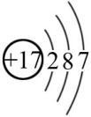

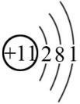

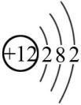

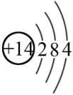

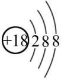

**答案：** （1）15（2）Ar（3）3（4）MgCl

---

### TK-C9-U3-020
| 字段 | 内容 |
|------|------|
| 章节 | 第三单元-物质构成的奥秘 |
| 来源 | 中考同步+一轮讲义 |
| 题型 | 填空题 |

**题目：** 学习化学后，我们学会了从微观角度认识事物，根据下列几种示意图，回答问题：图中 B、C、D、E 粒子共表示种元素。元素 E 处于第周期，写出 E 所表示的微粒符号。图中 D 是某元素原子结构示意图，则 x 的值为。
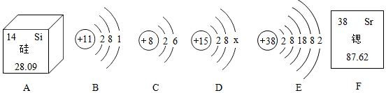

**答案：** 四；五；Sr；5

---

### TK-C9-U3-021
| 字段 | 内容 |
|------|------|
| 章节 | 第三单元-物质构成的奥秘 |
| 来源 | 中考同步+一轮讲义 |
| 题型 | 填空题 |

**题目：** 如图中 A﹣D 是某些原子结构示意图，F 为元素周期表的一部分，请回答：A﹣D  的粒子中易得到电子的是（填字母）。若 E 中 X＝12，则该粒子的符号。X、Y、Z 代表三种不同元素，其中 X、Y 化学性质相似的原因。

**答案：** AC；Mg2+；最外层电子数相同

---

### TK-C9-U3-022
| 字段 | 内容 |
|------|------|
| 章节 | 第三单元-物质构成的奥秘 |
| 来源 | 中考同步+一轮讲义 |
| 题型 | 填空题 |

**题目：** 核电荷数为 1~18  的元素的原子结构示意图等信息如下，请回答下列问题：请从上表中查出关于碳元素的一条信息：。在第三周期中，随着原子序数的递增，元素原子核外电子排布的变化规律是。（3）11 号元素的原子在化学反应中比较容易 （选填“得”或“失”）电子，形成的离子符号是 。说明元素的化学性质与原子结构中的 关系密切（填写序号）。①原子的核外电子数②元素的相对原子质量③元素的原子序数④原子的最外层电子数
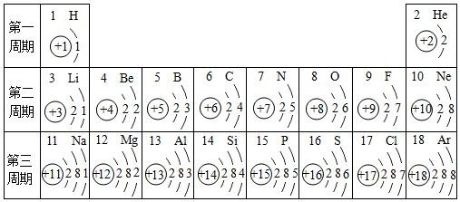

**答案：** 碳元素的原子序数为 6（碳原子核外有两个电子层等）最外层电子数依次增多失Na④

---

## 题目数量统计
| 来源 | 题目数 |
|------|--------|
| 中考同步+一轮讲义 | 22 |
| 合计 | 22 |
