# 第九单元-溶液 — 题库

> 来源：中考化学同步+一轮讲义 | 标注格式：TK-C9-U9-题序号

---

### TK-C9-U9-001
| 字段 | 内容 |
|------|------|
| 章节 | 第九单元-溶液 |
| 来源 | 中考同步+一轮讲义 |
| 题型 | 计算题 |

**题目：** 现有 100g20%氯化钠溶液，想把质量分数稀释到 5%，则需加水的质量为A．100 gB．200 gC．250 gD．300 g

**答案：** A

---

### TK-C9-U9-002
| 字段 | 内容 |
|------|------|
| 章节 | 第九单元-溶液 |
| 来源 | 中考同步+一轮讲义 |
| 题型 | 选择题 |

**题目：** 甲、乙两种固体的溶解度曲线如图所示，下列说法正确的是（）A．甲的溶解度大于乙的溶解度B．t1°C  时，甲乙饱和溶液中溶质的质量分数相等C．t2°C 时，60g 甲的饱和溶液稀释到 20%需加水 10gD．将 t1°C  时相等质量的甲、乙的饱和溶液升温到 t2°C，溶液中溶质的质量甲大于乙
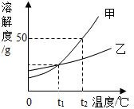

**答案：** A

---

### TK-C9-U9-003
| 字段 | 内容 |
|------|------|
| 章节 | 第九单元-溶液 |
| 来源 | 中考同步+一轮讲义 |
| 题型 | 选择题 |

**题目：** 现有编号为①、②、③的三个烧杯中均分别盛有 100 克水，20℃时向三个烧杯中分别加入 36 克、56 克、76 克的同种物质，充分溶解，实验结果如图所示。下列判断正确的是（）A．①中所得溶液一定是不饱和溶液 B．②③中所得溶液溶质的质量分数相等C．若②中溶液升温到 30℃，溶液的质量一定不变 D．若③中溶液恒温蒸发，溶质的质量分数一定变大
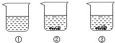

**答案：** B

---

### TK-C9-U9-004
| 字段 | 内容 |
|------|------|
| 章节 | 第九单元-溶液 |
| 来源 | 中考同步+一轮讲义 |
| 题型 | 选择题 |

**题目：** 20℃时，KCl 的溶解度是 34g，其含义是（） A．20℃时，KCl 溶液中含有 34gKClB．20℃时，100gKCl 溶液中的溶质为 34gC．20℃时，100g 水中溶解 34gKCl 恰好形成饱和溶液D．20℃时，100g 饱和 KCl 溶液中含有 34gKCl
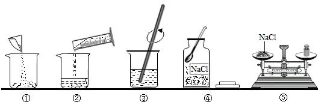

**答案：** A

---

### TK-C9-U9-005
| 字段 | 内容 |
|------|------|
| 章节 | 第九单元-溶液 |
| 来源 | 中考同步+一轮讲义 |
| 题型 | 选择题 |

**题目：** 如图是 KNO3 和 NH4Cl 的溶解度曲线，下列叙述错误的是（）A．t1℃时，KNO3 的溶解度与 NH4Cl 的溶解度相等 B．t2℃时，KNO3 饱和溶液中溶质的质量分数是 37.5% C．t1℃时，NH4Cl 的不饱和溶液降温，肯定无晶体析出D．t2℃时，KNO3 饱和溶液中溶质的质量分数大于 NH4Cl 饱和溶液中溶质的质量分数

**答案：** BAC

---

### TK-C9-U9-006
| 字段 | 内容 |
|------|------|
| 章节 | 第九单元-溶液 |
| 来源 | 中考同步+一轮讲义 |
| 题型 | 选择题 |

**题目：** 不同温度下 KNO3 的溶解度如下表所示。下列说法正确的是（）温度/℃203040溶解度/g31．645．863．9A．20℃时，100gKNO3 饱和溶液中溶质质量为

**答案：** E

---

### TK-C9-U9-007
| 字段 | 内容 |
|------|------|
| 章节 | 第九单元-溶液 |
| 来源 | 中考同步+一轮讲义 |
| 题型 | 选择题 |

**题目：** 本题有甲、乙两图，图甲为硝酸钾和氯化铵的溶解度曲线，图乙为兴趣小组进行的实验，  R 物质是硝酸钾或氯化铵中的一种。关于图乙中烧杯内的物质，下列说法正确的是（）A．R 物质是氯化铵B．溶液的溶质质量分数是烧杯①小于烧杯②C．若使烧杯③中的固体溶解，只能采用加水的方法 D．烧杯①②③中，只有烧杯③中上层清液是饱和溶液
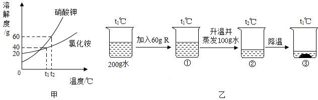

**答案：** D

---

### TK-C9-U9-008
| 字段 | 内容 |
|------|------|
| 章节 | 第九单元-溶液 |
| 来源 | 中考同步+一轮讲义 |
| 题型 | 选择题 |

**题目：** 盐湖地区人们常采用“夏天晒盐，冬天捞碱”的方法来获取 NaCl 和 Na2CO3。结合溶解度曲线判断，下列说法错误的是（）A．NaCl 的溶解度随温度变化不大B．44 ℃时 Na2CO3 饱和溶液的质量分数为 50% C．“夏天晒盐”的原理是让湖水蒸发结晶得到 NaCl D．“冬天捞碱”的原理是让湖水降温结晶得到 Na2CO3
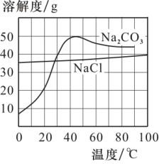

**答案：** C

---

### TK-C9-U9-009
| 字段 | 内容 |
|------|------|
| 章节 | 第九单元-溶液 |
| 来源 | 中考同步+一轮讲义 |
| 题型 | 选择题 |

**题目：** 如图是甲、乙两种固体物质（均不含结晶水）的溶解度曲线，下列说法正确的是（）A．t2℃时，甲的溶解度为 70B．乙中含有少量的甲，可用蒸发溶剂的方法提纯乙C．t2℃时，甲、乙两种物质的溶液分别降温到 t1℃，析出晶体的质量甲一定大于乙 D．t2℃时，甲的溶液降温到 t1℃，一定能得到甲的饱和溶液
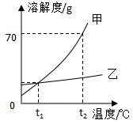

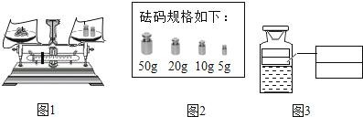

**答案：** 10g 和 5g；1g；84；烧杯、玻璃棒；16%氯化钠溶液

---

### TK-C9-U9-010
| 字段 | 内容 |
|------|------|
| 章节 | 第九单元-溶液 |
| 来源 | 中考同步+一轮讲义 |
| 题型 | 计算题 |

**题目：** 甲醛的化学式的 CH2O，某甲醛水溶液里甲醛分子中所含的氢原子与水分子中所含的氢原子数目相等，则该溶液中溶质的质量分数为A．47.1%B．52.9%C．62.5%D．88.9%

**答案：** （1）3；（1 分）（2）烧杯；（1 分）（3）AB。（1 分）

---

### TK-C9-U9-011
| 字段 | 内容 |
|------|------|
| 章节 | 第九单元-溶液 |
| 来源 | 中考同步+一轮讲义 |
| 题型 | 计算题 |

**题目：** 现有 W 克溶质的质量分数为 15%的 A 溶液，欲使其溶质的质量分数增至 30%，可采取的方法有A．蒸发掉溶剂的二分之一B．蒸发掉 0.5W g 溶剂C．加入 0.15W g A 物质D．加入 3 g A 物质

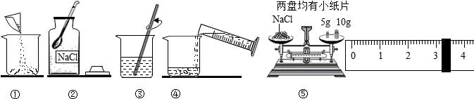

**答案：** （1）②⑤①④③；（2）药匙；（3）18.2g（；4）小于；（5）是；加速 食盐溶解。

---

### TK-C9-U9-012
| 字段 | 内容 |
|------|------|
| 章节 | 第九单元-溶液 |
| 来源 | 中考同步+一轮讲义 |
| 题型 | 选择题 |

**题目：** 甲、乙、丙三种物质的溶解度曲线如图所示，下列说法正确的是（）A．甲是易溶物B．60℃时，将等质量的甲、乙饱和溶液降温至 40℃，溶液的质量乙>甲 C．60℃时，将 100g 乙的饱和溶液配成质量分数为 5%的溶液，需加水 380g D．甲中混有少量丙，若要得到较纯净的甲，常采用蒸发结晶的方法
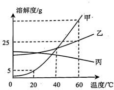

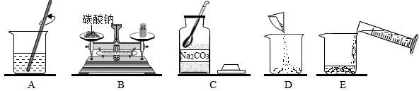

**答案：** (1). 20(2). 80(3). 100 mL(4). C→B→D→E→A(5). 烧杯、玻璃棒和胶头滴管(6). 偏低(7). B

---

### TK-C9-U9-013
| 字段 | 内容 |
|------|------|
| 章节 | 第九单元-溶液 |
| 来源 | 中考同步+一轮讲义 |
| 题型 | 选择题 |

**题目：** 甲、乙、丙三种固体物质溶解度曲线如下图所示。下列说法错误的是（）A．t1℃时,甲、乙的溶解度都是 25gB．t1℃时,将三种物质的饱和溶液均升温到  t2℃,能析出晶体的是丙C．将甲的饱和溶液从 t1℃升高到 t2℃,溶液中溶质的质量分数变为
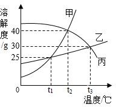

**答案：** C

---

### TK-C9-U9-014
| 字段 | 内容 |
|------|------|
| 章节 | 第九单元-溶液 |
| 来源 | 中考同步+一轮讲义 |
| 题型 | 选择题 |

**题目：** 甲、乙试管中各盛有 10.0g 水，向其中一支中加入 3.0g KNO3 固体，另一支中加入 3.0g NaCl 固体，按图 1 进行实验（KNO3 和 NaCl 的溶解度曲线如图 2），下列说法正确的是（）A．甲中加入的固体是 KNO3B．0℃时，甲中溶液可能饱和，乙中溶液一定饱和C．KNO3 中含有少量 NaCl 杂质，可用冷却 KNO3 热饱和溶液的方法提纯D．40℃时，若使图 1 中甲、乙试管内的溶液恰好变为相应饱和溶液，甲中加入对应的溶质质量大于乙中加入对应的溶质质量
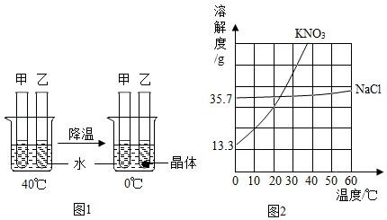

**答案：** C

---

### TK-C9-U9-015
| 字段 | 内容 |
|------|------|
| 章节 | 第九单元-溶液 |
| 来源 | 中考同步+一轮讲义 |
| 题型 | 选择题 |

**题目：** A、B、C   三种固体物质的溶解度曲线如图所示，下列说法正确的是（）A．阴影区域中，A、C  均处于不饱和状态B．除去 B 固体中含有的少量 A 杂质，可采用配成热饱和溶液，降温结晶、过滤、洗涤、干燥的方法提纯 BC．将 A 和 B 的饱和溶液从 t2℃降到 t1℃时，析出晶体的质量关系为 A＞BD．t1℃时，将 50g 固体 A 加入到 200g 水中，所得溶液溶质的质量分数约为 16.7%
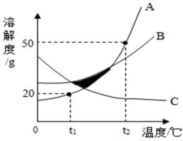

**答案：** D

---

### TK-C9-U9-016
| 字段 | 内容 |
|------|------|
| 章节 | 第九单元-溶液 |
| 来源 | 中考同步+一轮讲义 |
| 题型 | 计算题 |

**题目：** 甲、乙、丙三种固体物质的溶解度曲线如图所示，请根据图中信息回答下列问题：（1）t1℃时，甲物质的溶解度为g。（2）a 点对应的是 t2℃时乙物质的（填“饱和”或“不饱和”）溶液。（ 3 ） 现要从混有少量甲物质的乙物质溶液中提纯乙固体， 可采用的方法有（写出一种即可）。t3℃时，等质量的甲、乙、丙三种物质的饱和溶液中，所含水的质量最大的是（填“甲”“乙”或“丙”）溶液。把 t3℃时，甲、乙、丙三种物质的饱和溶液降温到 t1℃，所得溶液中溶质的质量分数的大小关系是（用“甲”“乙”“丙”及“＞”“＜”或“＝”表示）。
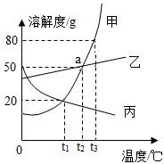

**答案：** （1）20；（2）饱和；（3）蒸发结晶；（4）丙；（5）乙＞甲＞丙。

---

### TK-C9-U9-017
| 字段 | 内容 |
|------|------|
| 章节 | 第九单元-溶液 |
| 来源 | 中考同步+一轮讲义 |
| 题型 | 选择题 |

**题目：** 溶液与人类生产、生活密切相关。把少量下列物质分别放入水中，充分搅拌，能得到溶液的是（填序号）。硝酸钾B．植物油C．面粉下列有关溶液的说法中，正确的是（填序号）。凡是均一的、稳定的液体一定是溶液 B．溶液是均一的、稳定的混合物C．溶液一定是无色的，且溶剂一定是水如图为甲、乙、丙三种固体物质的溶解度曲线。①t1℃时，甲、乙两种物质的溶解度（填“相等”或“不相等”）。②t2℃时，甲物质饱和溶液中溶质与溶剂的质量比为（填最简比）。③现有 t1℃时甲、乙、丙三种物质的饱和溶液，将这三种溶液分别升温到 t2℃，所得溶液中溶质质量分数大小关系是 （填序号）。A．甲>乙>丙B．甲=乙<丙C．甲=乙>丙用
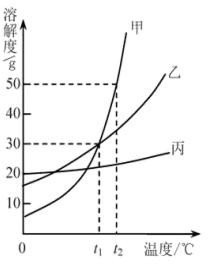

**答案：** (1) A； (2)B； (3)①相等； ②1:2 ；③C；(4)3；

---

### TK-C9-U9-018
| 字段 | 内容 |
|------|------|
| 章节 | 第九单元-溶液 |
| 来源 | 中考同步+一轮讲义 |
| 题型 | 计算题 |

**题目：** t℃时，将一定质量的甲、乙两种溶液进行恒温蒸发，蒸发溶剂的质量与析出晶体的质量之间的关系如图所示。回答下列问题：蒸发溶剂前，（填“甲”或“乙”）是饱和溶液；（2）b 点对应的乙溶液是（填“饱和溶液”或“不饱和溶液”）；t℃时，（填“甲”或“乙”）的溶解度更大；甲的饱和溶液的质量分数是（用含 m、n 的代数式表示）。
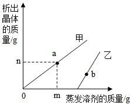

**答案：** （1）甲（2）饱和溶液（3）乙（4）n/(m+n)×100%

---

### TK-C9-U9-019
| 字段 | 内容 |
|------|------|
| 章节 | 第九单元-溶液 |
| 来源 | 中考同步+一轮讲义 |
| 题型 | 选择题 |

**题目：** 将 30g 固体物质 X（不含结晶水）投入盛有 20g 水的烧杯中，搅拌，测得 0℃、t1℃、 t2℃、t3℃时烧杯中溶液的质量分别如图中 A、B、C、D 点所示。回答下列问题：A、B  两点对应的溶液中溶质的质量分数较大的是（填字母编号）。（2）0℃时，物质 X 的溶解度是。A、B、C、D 四点对应的溶液中，一定属于饱和溶液的是（填字母编号）。下列说法正确的是（填序号）。①t1℃时，若向 B 点对应的烧杯中再加入 30g 水，搅拌，所得溶液为不饱和溶液②若要从 D 点对应的溶液中得到全部固体 X，可采用降温结晶的方法③t2℃时，将物质 X  的饱和溶液变为不饱和溶液，溶质的质量可能增大
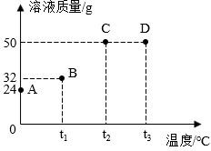

**答案：** （1）B；（2）20g；（3）A、B；（4） ③

---

### TK-C9-U9-020
| 字段 | 内容 |
|------|------|
| 章节 | 第九单元-溶液 |
| 来源 | 中考同步+一轮讲义 |
| 题型 | 计算题 |

**题目：** 在一定温度下，向 100g 水中依次加入一定质量的 KCl 固体，充分溶解，加入 KCl 固体的质量与所得溶液质量的关系如图所示：该温度下，实验①所得溶液是溶液（填“饱和”或“不饱和”）。该温度下，KCl 的溶解度为。实验③所得溶液中溶质的质量分数是（填选项序号）。a．40%b．37.5%c．28.6%第三课时  配制一定溶质质量分数的溶液用固体配制：①步骤：计算、称量、量取、溶解、装瓶贴标签。②仪器：托盘天平、药匙、量筒、胶头滴管、烧杯、玻璃棒用浓溶液稀释（稀释前后，溶质的质量不变）①步骤：计算、量取、稀释、装瓶存放②仪器：量筒、胶头滴管、烧杯、玻璃棒③稀释计算依据：以用水稀释为例：m
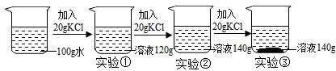

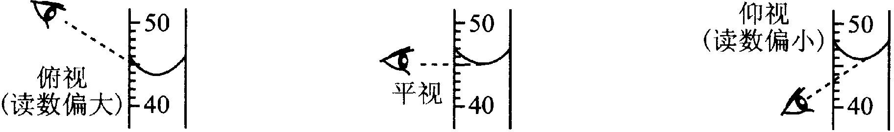

**答案：** （1）不饱和；（2）40g；（3）c。+第三课时 配制一定溶质质量分数的溶液1.【答案】B

---

### TK-C9-U9-021
| 字段 | 内容 |
|------|------|
| 章节 | 第九单元-溶液 |
| 来源 | 中考同步+一轮讲义 |
| 题型 | 填空题 |

**题目：** 实验室配制 100g10%的 NaCl 溶液，不需要用到的仪器是()A.酒精灯B.托盘天平 C.胶头滴管 D.烧杯

**答案：** A.

---

## 题目数量统计
| 来源 | 题目数 |
|------|--------|
| 中考同步+一轮讲义 | 21 |
| 合计 | 21 |
