# 第二单元-空气和氧气 — 题库

> 来源：中考化学同步+一轮讲义 | 标注格式：TK-C9-U2-题序号

---

### TK-C9-U2-001
| 字段 | 内容 |
|------|------|
| 章节 | 第二单元-空气和氧气 |
| 来源 | 中考同步+一轮讲义 |
| 题型 | 选择题 |

**题目：** 下列有关氧气的说法，正确的是(填字母)。 A．氧气支持燃烧，可以作燃料B．氧气能使带火星的木条复燃，说明氧气具有可燃性 C．鱼类能在水中生存，说明氧气易溶于水D．铁、碳、蜡烛在氧气中燃烧都是化合反应 E．细铁丝在氧气中燃烧生成黑色固体 Fe2O3 F．氧气化学性质比较活泼，可跟任何物质反应 G．通常状况下，氧气无色无味、不易溶于水 H．氧气可支持植物进行光合作用I.硫在氧气中燃烧，产生淡蓝色火焰，生成有刺激性气味的气体  J.红磷在空气中燃烧产生大量白烟K.木炭在空气中燃烧发出白光，生成能使澄清石灰水变浑浊的气体

**答案：** GJ

---

### TK-C9-U2-002
| 字段 | 内容 |
|------|------|
| 章节 | 第二单元-空气和氧气 |
| 来源 | 中考同步+一轮讲义 |
| 题型 | 选择题 |

**题目：** 列物质在氧气中燃烧，有刺激性气味的气体生成的是（）A． 镁条B． 铁丝C． 白磷

**答案：** D

---

### TK-C9-U2-003
| 字段 | 内容 |
|------|------|
| 章节 | 第二单元-空气和氧气 |
| 来源 | 中考同步+一轮讲义 |
| 题型 | 选择题 |

**题目：** 下列有关实验现象描述不．正．确．的是（）D． 硫A．在空气中加热铁丝，铁丝火星四射B．硫在氧气中燃烧发出蓝紫色火焰C．镁条在空气中燃烧发出耀眼的白光D．打开盛放浓盐酸的试剂瓶盖，瓶口有白雾产生

**答案：** A.

---

### TK-C9-U2-004
| 字段 | 内容 |
|------|------|
| 章节 | 第二单元-空气和氧气 |
| 来源 | 中考同步+一轮讲义 |
| 题型 | 选择题 |

**题目：** “新冠”重症患者需要使用呼吸机来为其提供氧气，下列关于氧气的描述错误的是（）A．  在通常状况下，氧气是一种无色、无味的气体B．  氧气在低温、高压时能变为液体或固体C． 氧气极易溶于水D． 隔绝氧气能达到灭火的目的实验室用  KMnO4 制氧气并验证氧气的性质，下列操作正确的是（）检査装置气密性B．加热 KMnO4 制 O2C．验证 O2 已集满D．硫在 O2 中燃烧下列有关催化剂的说法中不．正．确．的是（）A、催化剂可以改变某些化学反应的速率B、催化剂在化学反应前后质量与化学性质均不改变C、催化剂可以提高反应生成物的质量D、在双氧水溶液加入二氧化锰不是反应物，而是催化剂
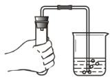

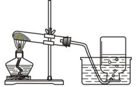

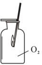

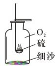

**答案：** C

---

### TK-C9-U2-005
| 字段 | 内容 |
|------|------|
| 章节 | 第二单元-空气和氧气 |
| 来源 | 中考同步+一轮讲义 |
| 题型 | 填空题 |

**题目：** 实验室制取氧气，有下述①~⑥个操作步骤，正确的操作顺序是①点燃酒精灯，加热试管②检查装置的气密性③将高锰酸钾加入试管，管口塞一团棉花，塞上带有导管的塞子，固定在铁架台上④用排水法收集氧气⑤熄灭酒精灯⑥将导管从水槽中取出A．②③①④⑥⑤B．②③①④⑤⑥C．③②①④⑥⑤D．③④①②⑤⑥

**答案：** A

---

### TK-C9-U2-006
| 字段 | 内容 |
|------|------|
| 章节 | 第二单元-空气和氧气 |
| 来源 | 中考同步+一轮讲义 |
| 题型 | 填空题 |

**题目：** 规范操作是科学实验成功的关键。下列用高锰酸钾制取并检验氧气的实验操作中，不合理的是A．B．C．D．
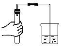

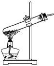

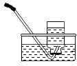

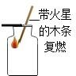

**答案：** B

---

### TK-C9-U2-007
| 字段 | 内容 |
|------|------|
| 章节 | 第二单元-空气和氧气 |
| 来源 | 中考同步+一轮讲义 |
| 题型 | 填空题 |

**题目：** 验室用过氧化氢溶液与二氧化锰混合制取氧气，一般有以下几个步骤：①向长颈漏斗中倒入过氧化氢溶液  ②向容器中加入少量二氧化锰③检查装置的气密性 ④收集气体正确的操作顺序是()A．①②③④B．②①④③C．③②④①D．③②①④

**答案：** D

---

### TK-C9-U2-008
| 字段 | 内容 |
|------|------|
| 章节 | 第二单元-空气和氧气 |
| 来源 | 中考同步+一轮讲义 |
| 题型 | 选择题 |

**题目：** 氧气是生命活动的必需气体。下列关于氧气的性质、制备说法不．正确的是（）A．双氧水制取氧气时，先加固体二氧化锰，再加液体双氧水 B．可用向上排空气法或排水法收集氧气C．排水法收集氧气，待导管口出现连续而均匀气泡时，再将导管伸入瓶口收集气体  D．利用上图装置可比较 MnO2 和 CuO 对 H2O2 分解的影响
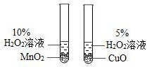

**答案：** D

---

### TK-C9-U2-009
| 字段 | 内容 |
|------|------|
| 章节 | 第二单元-空气和氧气 |
| 来源 | 中考同步+一轮讲义 |
| 题型 | 选择题 |

**题目：** 下列有关催化剂的说法正确的是（）A．在化学反应中能加快其他物质的反应速率，而本身的质量和性质在化学反应前后都没有改变的物质称为催化剂B．二氧化锰是一切化学反应的催化剂C．催化剂只能改变化学反应速率，不能增加或减少生成物的质量D．要使过氧化氢溶液分解出氧气必须加入二氧化锰，否则就不能发生分解反应

**答案：** C

---

### TK-C9-U2-010
| 字段 | 内容 |
|------|------|
| 章节 | 第二单元-空气和氧气 |
| 来源 | 中考同步+一轮讲义 |
| 题型 | 选择题 |

**题目：** 实验室用氯酸钾和二氧化锰的混合物制氧气，充分反应后，为回收催化剂，将试管里剩下的物质进行处理，实验步骤正确的是①溶解②结晶③过滤④蒸发⑤洗涤⑥干燥 A．①③⑤⑥B．①③②⑤C．①③④⑤D．①③④②

**答案：** A

---

### TK-C9-U2-011
| 字段 | 内容 |
|------|------|
| 章节 | 第二单元-空气和氧气 |
| 来源 | 中考同步+一轮讲义 |
| 题型 | 选择题 |

**题目：** 某同学用少量的二氧化锰和 30ml  5%双氧水制备氧气，下列图像错误的是：A．B．C．D．
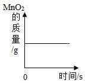

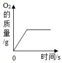

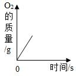

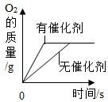

**答案：** C

---

### TK-C9-U2-012
| 字段 | 内容 |
|------|------|
| 章节 | 第二单元-空气和氧气 |
| 来源 | 中考同步+一轮讲义 |
| 题型 | 填空题 |

**题目：** 下列图象能正确反映其对应操作中各量变化关系的是A．加热一定量高锰酸钾固体B．密闭容器中燃烧一定量的红磷C．加热一定量的氯酸钾和二氧化锰的混合物D．在少量二氧化锰中加入一定量双氧水
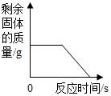

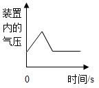

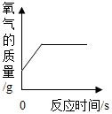

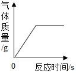

**答案：** D

---

### TK-C9-U2-013
| 字段 | 内容 |
|------|------|
| 章节 | 第二单元-空气和氧气 |
| 来源 | 中考同步+一轮讲义 |
| 题型 | 填空题 |

**题目：** （1）小亮同学想探究氧气的性质．他收集两瓶氧气，如图所示：甲瓶瓶口朝上放，乙瓶瓶口朝下放，并迅速用两根带火星的木条分别伸人两个集气瓶中．请猜想一下，在两个集气瓶中他将观察到的现象是 ，由此可知道氧气的一条化学性质是甲 ．（2）哪个集气瓶中的木条燃烧的更旺些？（填“甲”或“乙”），理由是．由此还可联想到在实验室收集到的集气瓶中的氧气应（填“正立”或“倒立”）放在桌面上．
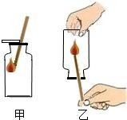

**答案：** （1）甲、乙两集气瓶内木条均复燃；可以助燃；甲；氧气的密度比空气大，乙瓶中氧气从氧气瓶口流出；正立．

---

### TK-C9-U2-014
| 字段 | 内容 |
|------|------|
| 章节 | 第二单元-空气和氧气 |
| 来源 | 中考同步+一轮讲义 |
| 题型 | 填空题 |

**题目：** 根据下图回答问题：写出仪器①的名称：。实验室若用装置 A 制取较纯净的氧气，反应的化学方程式为，可以选（填装置序号）作收集装置。实验室制取  CO2（固液不加热型反应），应选择的发生和收集装置的组合是（填装置序号）。在装入药品前，必须要进行的实验操作是。

**答案：** 集气瓶；2KMnO4=K2MnO4+MnO2+O2↑；E；BC；检查装置的气密性

---

### TK-C9-U2-015
| 字段 | 内容 |
|------|------|
| 章节 | 第二单元-空气和氧气 |
| 来源 | 中考同步+一轮讲义 |
| 题型 | 计算题 |

**题目：** 资料显示，将新制的溶质质量分数为 5%的 H2O2 溶液，加热到 80℃时，才有较多氧气产生，而相同质量 5%的 H2O2 溶液加入催化剂，常温下就会立即产生氧气，反应速度快，所需时间短．小晨按图甲装置进行实验，当试管中有大量气泡出现时，伸入带火星的木条，木条并未复燃，为此，他利用图乙装置收集气体，再用带火星的木条检验，木条复燃，那么图甲实验中带火星木条未复燃的原因是 ．小柯利用催化剂使 H2O2 溶液分解制取氧气，图丙是他设计的气体发生装置，请你指出一处错误．采用相同质量 5%的 H2O2 溶液，图丁虚线表示加热分解制取氧气的曲线，请你在该图中用实线画出利用催化剂制取氧气的大致曲线．（
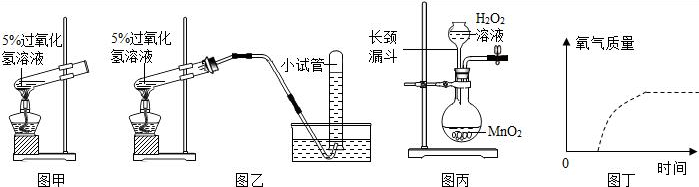

**答案：** (1)加热过氧化氢溶液的同时，溶液中的水蒸气随氧气一起逸出，环境湿度较大，氧气的量较少；(2)长颈漏斗的下端未伸入液面以下；(3)见图．

---

### TK-C9-U2-016
| 字段 | 内容 |
|------|------|
| 章节 | 第二单元-空气和氧气 |
| 来源 | 中考同步+一轮讲义 |
| 题型 | 填空题 |

**题目：** 如图是实验室常用的装置，请据图回答：写出标号仪器的名称：①，②。装置 A 中不妥之处是。装置改进后，若实验室用加热高锰酸钾固体制取一瓶氧气，来做蜡烛燃烧产物的探究实验，应选用的一组装置是          （填装置字母序号）。实验室用高锰酸钾制取氧气的化学方程式为 。
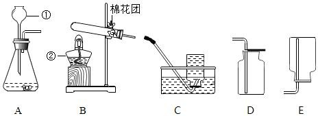

**答案：** （1）长颈漏斗；酒精灯；（2）长颈漏斗下端没有伸入液面以下；（3）BD；2KMnO4 K2MnO4+MnO2+O2↑。

---

### TK-C9-U2-017
| 字段 | 内容 |
|------|------|
| 章节 | 第二单元-空气和氧气 |
| 来源 | 中考同步+一轮讲义 |
| 题型 | 填空题 |

**题目：** 实验室制取气体时需要的部分仪器和装置如下图所示，请回答下列问题。写出图甲中 B、G 两种仪器的名称：B；G。加热氯酸钾和二氧化锰可生成氯化钾和氧气，可用于实验室制氧气，若要用这一方法制取一瓶较为纯净的氧气，应从图甲中选用的仪器装置是 。（填字母编号）实验室中可用过氧化氢溶液与二氧化锰制取氧气，反应的文字表式为。其中二氧化锰的作用是。图乙是用过氧化氢和二氧化锰制取氧气的发生装置，从控制反应速率和节约药品的角度考虑，发生装置最好选用（填装置序号），连接好仪器，装入药品前应先。确定实验室制取气体的反应原理时，需要考虑的因素是（选填字母序号）。 A．药品容易获得，能生成所要制取的气体 B．反应条

**答案：** 试管酒精灯ABDEG过氧化氢二氧化锰 水 氧气化作用N检查装置的气密性ABC

---

## 题目数量统计
| 来源 | 题目数 |
|------|--------|
| 中考同步+一轮讲义 | 17 |
| 合计 | 17 |
