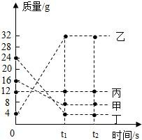
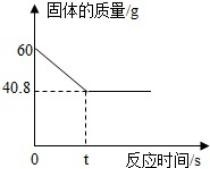

# 第五单元-化学反应的定量关系 — 题库

> 来源：中考化学同步+一轮讲义 | 标注格式：TK-C9-U5-题序号

---

### TK-C9-U5-001
| 字段 | 内容 |
|------|------|
| 章节 | 第五单元-化学反应的定量关系 |
| 来源 | 中考同步+一轮讲义 |
| 题型 | 选择题 |

**题目：** 在化学方程式 aC2H6+bO2=====mCO2+nH2O  中，化学计量数之间的关系正确的是（）A．2m＝aB．3a＝nC．3m＝nD．2b＝m+n

**答案：** B

---

### TK-C9-U5-002
| 字段 | 内容 |
|------|------|
| 章节 | 第五单元-化学反应的定量关系 |
| 来源 | 中考同步+一轮讲义 |
| 题型 | 选择题 |

**题目：** 在炼铁工业中，常用石灰石将铁矿石中的杂质二氧化硅转化为炉渣除去，发生反应的化高温学方程式为：CaCO3+SiO2=====X+CO2↑，其中 X 的化学式是（ ）A. CaSiO4B. Ca2SiO3C. CaSi2O3D. CaSiO3

**答案：** D

---

### TK-C9-U5-003
| 字段 | 内容 |
|------|------|
| 章节 | 第五单元-化学反应的定量关系 |
| 来源 | 中考同步+一轮讲义 |
| 题型 | 填空题 |

**题目：** 在一密闭容器中加入甲、乙、丙、丁四种物质，在运动条件下发生化学反应，测得反应前及 t

**答案：** D

---

### TK-C9-U5-004
| 字段 | 内容 |
|------|------|
| 章节 | 第五单元-化学反应的定量关系 |
| 来源 | 中考同步+一轮讲义 |
| 题型 | 选择题 |

**题目：** 有关 2H2+O2 点燃 2H2O 的叙述正确的是（） A．2g 氢气和 1g 氧气在点燃条件下反应生成 2g 水 B．氢气加氧气点燃等于水C．两个氢分子加一个氧分子等于两个水分子 D．氢气和氧气在点燃条件下反应生成水

**答案：** D

---

### TK-C9-U5-005
| 字段 | 内容 |
|------|------|
| 章节 | 第五单元-化学反应的定量关系 |
| 来源 | 中考同步+一轮讲义 |
| 题型 | 选择题 |

**题目：** 法医常用马氏试砷法来证明是否砒霜中毒，其反应的化学方程式为：R + 8HCl + 4Zn = 4ZnCl2+ 3H2O + 2As + H2↑，则砒霜（R）的化学式为（）A．As2O2B．As2OC．AsOD．As2O3

**答案：** D

---

### TK-C9-U5-006
| 字段 | 内容 |
|------|------|
| 章节 | 第五单元-化学反应的定量关系 |
| 来源 | 中考同步+一轮讲义 |
| 题型 | 填空题 |

**题目：** 配平下列化学方程式点燃点燃P + O2 =====P2O5（2） C + O2===== CO点燃（3） Al+ O2 =====Al2O3（4） Fe+O2点燃===== Fe3O4（5）点燃Mg+O2===== MgO（6）MnO2 H2O2=====H2O +O2↑通电点燃（7） H2O ===== H2↑+O2↑（8） H2 + O2 =====H2O

**答案：** ：（1）4P + 5O2点燃=====2 P2O5（2） 2C + O2点燃===== 2CO（3）4Al + 3O2点燃===== 2Al2O3（4）3 Fe + 2O2点燃 Fe3O42Mg + O2点燃===== 2MgO2H2O2MnO2===== 2H2O + O2↑通电2H2O=====2H2↑+ O2↑点燃2H2 + O2=====2H2O

---

### TK-C9-U5-007
| 字段 | 内容 |
|------|------|
| 章节 | 第五单元-化学反应的定量关系 |
| 来源 | 中考同步+一轮讲义 |
| 题型 | 填空题 |

**题目：** 根据方程式有关知识，回答下列问题（1）3Cu+8HNO3 ==3Cu（NO3）2+2X↑+4 H2O，求 X 的化学式为。R+3O2==2CO2+3H2O求 R 的化学式为。（3）4K2Cr2O8==4K2CrO4+2R+3O2求 R 的化学式为。（4）a C3H6+bO2==cCO2+dH2O找出 a、b、c 之间的等量关系。

**答案：** 1、NO2、C2H6O3、Cr2O54、3a=b等等

---

### TK-C9-U5-008
| 字段 | 内容 |
|------|------|
| 章节 | 第五单元-化学反应的定量关系 |
| 来源 | 中考同步+一轮讲义 |
| 题型 | 填空题 |

**题目：** 在常温下完全电解 90mL 的水，正极与负极产生的气体的体积比为，产生氧气的质量为克（设常温下水的密度为 1g/cm3）。

**答案：** 1：2；

---

### TK-C9-U5-009
| 字段 | 内容 |
|------|------|
| 章节 | 第五单元-化学反应的定量关系 |
| 来源 | 中考同步+一轮讲义 |
| 题型 | 计算题 |

**题目：** 某学习小组在实验室中用加热氯酸钾和二氧化锰混合物的方法制取氧气，反应过程中固体质量变化如图所示，请计算．制取氧气的质量是g．原混合物中氯酸钾的质量分数．（写出计算过程，计算结果精确到  0.1%）化学超人中考化学同步+一轮系列课81

**答案：** 19.2g；81.7%

---

### TK-C9-U5-010
| 字段 | 内容 |
|------|------|
| 章节 | 第五单元-化学反应的定量关系 |
| 来源 | 中考同步+一轮讲义 |
| 题型 | 填空题 |

**题目：** （差量法）将 8.4  g  表面有氧化铜的粗铜丝在加热条件下与足量的氢气充分反应后得到△8.0 g  铜。试求参加反应的氢气及反应后生成铜的质量。（CuO＋H2=====Cu＋H2O）

**答案：** 氢气质量为 0.05 g，反应后生成铜的质量为 1.6 g

---

### TK-C9-U5-011
| 字段 | 内容 |
|------|------|
| 章节 | 第五单元-化学反应的定量关系 |
| 来源 | 中考同步+一轮讲义 |
| 题型 | 填空题 |

**题目：** （求范围用极限法）镁在氧气与氮气的混合气体中燃烧不仅生成氧化镁，还有少量的镁与氮气化合生成氮化镁（Mg3N2）。由此推知 8 g 镁在氧气与氮气的混和气体中完全燃烧后所得产物的质量的范围是多少？

**答案：** 生成物介于 11.1g 到 13.3g 之间。

---

### TK-C9-U5-012
| 字段 | 内容 |
|------|------|
| 章节 | 第五单元-化学反应的定量关系 |
| 来源 | 中考同步+一轮讲义 |
| 题型 | 计算题 |

**题目：** 甲醇(CH3OH)是一种有毒、有酒的气味的可燃性液体。甲醇在氧气中不完全燃烧可发生点燃如下反应:8CH3OH+nO2=====mCO2+2CO+16H2O。若反应生成 3.6 g 水,请计算:（1）m 的值是。（2）参加反应的氧气质量是多少克?(写出规范计算步骤)

**答案：** （1）6（2）参加反应的氧气为 4.4 g。

---

### TK-C9-U5-013
| 字段 | 内容 |
|------|------|
| 章节 | 第五单元-化学反应的定量关系 |
| 来源 | 中考同步+一轮讲义 |
| 题型 | 计算题 |

**题目：** 某校兴趣小组在实验室中完成制取氧气的实验。他们取氯酸钾和二氧化锰的混合物共 3.0 g 放入大试管中加热，并在不同时刻测定试管内剩余固体物质的质量（如表）：反应时间/min1.01.52.02.53.0剩余固体质量/g2.552.252.102.042.04分析表中数据，完成下列问题：完全反应后，生成氧气的质量为g；原混合物中二氧化锰的质量分数是多少？（写出计算过程，结果精确到 0.1%）

**答案：** （1）0.96；（2）18.3%。

---

### TK-C9-U5-014
| 字段 | 内容 |
|------|------|
| 章节 | 第五单元-化学反应的定量关系 |
| 来源 | 中考同步+一轮讲义 |
| 题型 | 计算题 |

**题目：** 侯德榜是我国著名的化学家，发明了侯氏制碱法，其反应原理如下： NaCl＋CO2＋NH3＋H2O=== NaHCO3＋NH4Cl，请计算：氯化铵中氮元素的质量分数。生产 8.4 t 碳酸氢钠，理论上需要氯化钠的质量。

**答案：** (1)氯化铵中氮元素的质量分数为 26.2%(2)生产 8.4 t 碳酸氢钠理论上需要氯化钠的质量为 5.85 t。

---

### TK-C9-U5-015
| 字段 | 内容 |
|------|------|
| 章节 | 第五单元-化学反应的定量关系 |
| 来源 | 中考同步+一轮讲义 |
| 题型 | 填空题 |

**题目：** 氢化钙（CaH2）是一种重要的制氢剂，与水接触时发生如下反应： CaH2+2H2O = Ca(OH) 2+2H2↑。若要制得 2 g 氢气，需 CaH2 的质量为多少？

**答案：** 21 g

---

### TK-C9-U5-016
| 字段 | 内容 |
|------|------|
| 章节 | 第五单元-化学反应的定量关系 |
| 来源 | 中考同步+一轮讲义 |
| 题型 | 计算题 |

**题目：** 把干燥、纯净的氯酸钾和二氧化锰的混合物 15.5  克装入大试管中，加热制取氧气．待反应完全后，将试管冷却、称量，得到 10.7  克固体物质，计算：制得氧气多少克？原混合物中，氯酸钾和二氧化锰的质量各多少克？

**答案：** （1）生成氧气的质量是 4.8g；（2）原混合物中氯酸钾和二氧化锰分别为 12.25g和 3.25g。

---

### TK-C9-U5-017
| 字段 | 内容 |
|------|------|
| 章节 | 第五单元-化学反应的定量关系 |
| 来源 | 中考同步+一轮讲义 |
| 题型 | 计算题 |

**题目：** 已知标准状况下，氮气的密度为 1.25g/L。氮化硅（化学式为 Si3N4）是一种新型陶瓷材料，可用气相沉积法制得，反应原理为：3SiCl4+2N2+6H2=Si3N4+12HCl。现需要制取 14g 氮化硅，求：请根据化学方程计算需要消耗氮气的质量。若这些氮气全部来自空气，则需要消耗空气的体积约多少升（精确到  0.1L）。

**答案：** （1）5.6g；（2）5.6

---

## 题目数量统计
| 来源 | 题目数 |
|------|--------|
| 中考同步+一轮讲义 | 17 |
| 合计 | 17 |
