# 第八单元-金属和金属材料 — 题库

> 来源：中考化学同步+一轮讲义 | 标注格式：TK-C9-U8-题序号

---

### TK-C9-U8-001
| 字段 | 内容 |
|------|------|
| 章节 | 第八单元-金属和金属材料 |
| 来源 | 中考同步+一轮讲义 |
| 题型 | 选择题 |

**题目：** 如图是一氧化碳还原氧化铁及产物检验的实验，有关说法不正确的是（）A．V 形管中发生的反应为 Fe2O3+3CO2Fe+3CO2B．该装置中试管的作用是防止石灰水倒吸C．待万用瓶中澄清石灰水下降至安全线以下后再点燃酒精灯 D．万用瓶中的澄清石灰水只用于检验生成的气体为 CO2
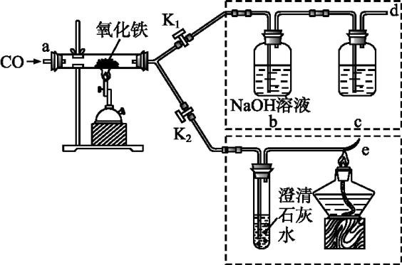

**答案：** A.

---

### TK-C9-U8-002
| 字段 | 内容 |
|------|------|
| 章节 | 第八单元-金属和金属材料 |
| 来源 | 中考同步+一轮讲义 |
| 题型 | 选择题 |

**题目：** 工业上利用赤铁矿石（主要成分是 Fe2O3，还含少量 SiO2 等杂质）冶炼生铁的过程如图所示：下列说法不正确的是（）A．CaSiO3 中硅元素显+4 价B．高炉气体中 SO2 会形成酸雨，不能直接排放到空气中C．原料中焦炭的作用之一是生成具有还原性的物质  COD．高炉炼铁的原理是 3CO+Fe2O3 2Fe+3CO2，该反应属于置换反应3 、 用 一 氧 化 碳 还 原 氧 化 铁 的 实 验 中 ， Fe2O3 转 化 为 铁 的 具 体 过 程 是 ： Fe2O3Fe3O4FeOFe，已知铁的氧化物除 Fe2O3 外，其余均为黑色。下列说法正确的是（  ）A．装置中漏斗的作用是防止
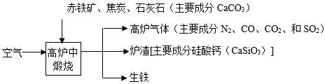

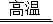

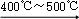

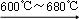

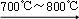

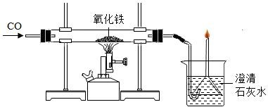

**答案：** C

---

### TK-C9-U8-003
| 字段 | 内容 |
|------|------|
| 章节 | 第八单元-金属和金属材料 |
| 来源 | 中考同步+一轮讲义 |
| 题型 | 选择题 |

**题目：** 线上学习，居家实验。小明用三枚洁净无锈的铁钉，设计如图所示实验，探究铁生锈的条件。下列说法错误的是（）A．乙试管中植物油的作用是隔绝空气 B．只有甲试管中的铁钉有明显锈迹C．乙丙两支试管的实验现象说明铁生锈需要水 D．实验表明铁生锈是铁与空气和水共同作用的结果
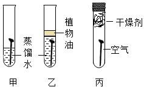

**答案：** B

---

### TK-C9-U8-004
| 字段 | 内容 |
|------|------|
| 章节 | 第八单元-金属和金属材料 |
| 来源 | 中考同步+一轮讲义 |
| 题型 | 选择题 |

**题目：** 如图是探究铁钉锈蚀条件的 4  个实验，一段时间后观察现象。下列说法不正确的是（）A．①中甲、乙、丙三处比较，生锈最明显的地方是甲 B．①②对比说明铁生锈需要空气，①③对比说明铁生锈需要水 C．③中附着在棉花上的氯化钙的作用是作干燥剂D．四个实验中，生锈最快的是④中的铁钉
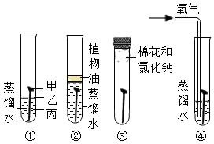

**答案：** D

---

### TK-C9-U8-005
| 字段 | 内容 |
|------|------|
| 章节 | 第八单元-金属和金属材料 |
| 来源 | 中考同步+一轮讲义 |
| 题型 | 选择题 |

**题目：** 下列有关金属资源的利用与防护解释不合理的是（）A．在 001A 型国产航母金属外壳覆盖涂料，主要是为了美观B．用“烤蓝”的方法处理钢铁表面，可减缓钢铁的腐蚀C．用铝合金制造国产大飞机 C919  机壳，是利用铝合金强度大、质量轻、抗腐蚀D．切菜后的菜刀用清水洗净擦干，可减缓菜刀生锈

**答案：** C

---

### TK-C9-U8-006
| 字段 | 内容 |
|------|------|
| 章节 | 第八单元-金属和金属材料 |
| 来源 | 中考同步+一轮讲义 |
| 题型 | 选择题 |

**题目：** 利用甲酸（HCOOH）与浓硫酸制备 CO，并用如图实验装置验证 CO 的有关性质。已知：HCOOHCO↑+H2O下列说法不正确的是（）A．操作时，先点燃乙处酒精灯，再滴加 HCOOH B．装置丙的作用是防止倒吸C．装置丁既可检验 CO2，又可收集 COD．随着反应进行，浓硫酸浓度降低，产生 CO  气体速率减小
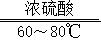

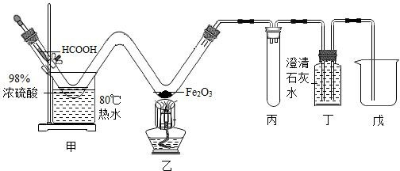

**答案：** C

---

### TK-C9-U8-007
| 字段 | 内容 |
|------|------|
| 章节 | 第八单元-金属和金属材料 |
| 来源 | 中考同步+一轮讲义 |
| 题型 | 选择题 |

**题目：** 下列有关模拟工业炼铁的叙述不正确的是（）A．硬质玻璃管中红色固体变为银白色 B．用燃着的酒精灯可防止 CO 污染空气 C．赤铁矿的主要成分是 Fe2O3D．实验结束后先移去酒精喷灯，继续通 CO  直至硬质玻璃管冷却
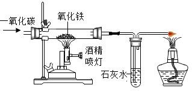

**答案：** B

---

### TK-C9-U8-008
| 字段 | 内容 |
|------|------|
| 章节 | 第八单元-金属和金属材料 |
| 来源 | 中考同步+一轮讲义 |
| 题型 | 选择题 |

**题目：** 实验室用下图装置模拟炼铁，下列说法正确的是（）A．磁铁矿的主要成分是 Fe2O3 B．氧化铁发生了氧化反应 C．红棕色粉末逐渐变黑D．实验结束时，先停止通 CO，再停止加热
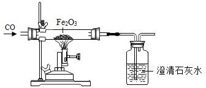

**答案：** B

---

### TK-C9-U8-009
| 字段 | 内容 |
|------|------|
| 章节 | 第八单元-金属和金属材料 |
| 来源 | 中考同步+一轮讲义 |
| 题型 | 选择题 |

**题目：** 小明笔记中有一处错误，你认为是图中的哪一处（）A．a 处B．b 处C．c 处D．d 处
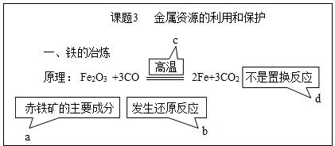

**答案：** D

---

### TK-C9-U8-010
| 字段 | 内容 |
|------|------|
| 章节 | 第八单元-金属和金属材料 |
| 来源 | 中考同步+一轮讲义 |
| 题型 | 选择题 |

**题目：** 用“W”型管进行微型实验，如图所示，下列说法错误的是（）A．a 处红棕色粉末变为黑色B．a 处实验结束时先停止通入 CO，后停止加热C．b  处澄清石灰水变浑浊证明有二氧化碳生成D．可利用点燃的方法进行尾气处理
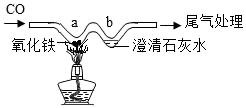

**答案：** D

---

### TK-C9-U8-011
| 字段 | 内容 |
|------|------|
| 章节 | 第八单元-金属和金属材料 |
| 来源 | 中考同步+一轮讲义 |
| 题型 | 填空题 |

**题目：** 早在春秋战国时期，我国就开始生产和使用铁器。工业上炼铁的原理是利用一氧化碳和氧化铁的反应。某化学兴趣小组利用如图装置进行实验探究，请按要求填空：为了避免玻璃管在加热时可能发生爆炸，加热前应；写出 CO 还原 Fe2O3 的化学方程式；右侧出口处使用燃着的酒精灯的目的是。
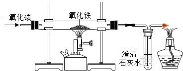

**答案：** B

---

### TK-C9-U8-012
| 字段 | 内容 |
|------|------|
| 章节 | 第八单元-金属和金属材料 |
| 来源 | 中考同步+一轮讲义 |
| 题型 | 填空题 |

**题目：** 生铁用途十分广泛。工业上利用赤铁矿（主要成分是 Fe2O3，还含少量 SiO2 等杂质）冶炼生铁的过程如图：回答下列问题：生铁属于材料（填“合成”或“金属”）。“高炉气体”中的（填化学式）会导致酸雨。“煅烧”时：高温①生成 CO 的反应之一为 C+CO2=====2CO，该反应属于反应（填基本反应类型）。②用化学方程式表示利用 CO 炼铁的原理。③CaCO3 和 SiO2 固体在高温条件下发生反应，生成 CO2 气体和 CaSiO3，该反应的化学方程式为。生活中铁制品锈蚀的过程，实际上是 Fe  与空气中、等发生化学反应的过程。下列措施能防止铁制品锈蚀的是（填标号）。A．涂油、喷漆B．镀
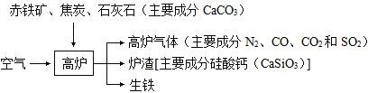

**答案：** A

---

### TK-C9-U8-013
| 字段 | 内容 |
|------|------|
| 章节 | 第八单元-金属和金属材料 |
| 来源 | 中考同步+一轮讲义 |
| 题型 | 填空题 |

**题目：** 铁的冶炼与利用是学习和研究化学的重要课题。铁的冶炼。竖炉炼铁的工艺流程如图 1 所示。“燃烧室”中 CH4 燃烧的作用是写出“还原反应室”中炼铁的一个反应的化学方程式。CH4 与高温尾气中的 CO2 或 H2O 都能反应生成 CO 和 H2，则 16 g CH4 在化反应室中完全反应后，理论上得到 H2 的质量(m)范围是。铁的利用，利用铁炭混合物(铁屑和活性炭的混合物)处理含有 Cu(NO3)

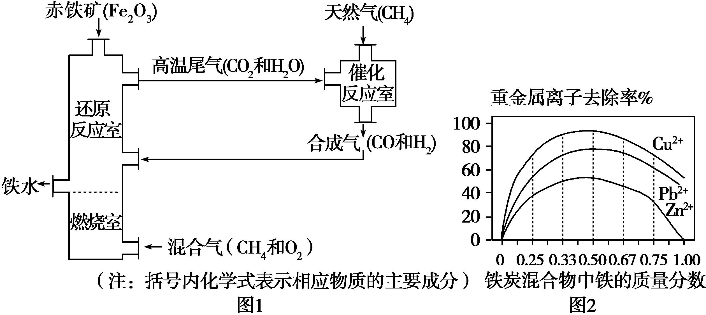

**答案：** A

---

### TK-C9-U8-014
| 字段 | 内容 |
|------|------|
| 章节 | 第八单元-金属和金属材料 |
| 来源 | 中考同步+一轮讲义 |
| 题型 | 填空题 |

**题目：** 某校化学兴趣小组的同学，对课本中一氧化碳还原氧化铁实验作了绿色化改进后制取单质铁(K

**答案：** A

---

## 题目数量统计
| 来源 | 题目数 |
|------|--------|
| 中考同步+一轮讲义 | 14 |
| 合计 | 14 |
