# 第六单元-碳和碳的氧化物 — 题库

> 来源：中考化学同步+一轮讲义 | 标注格式：TK-C9-U6-题序号

---

### TK-C9-U6-001
| 字段 | 内容 |
|------|------|
| 章节 | 第六单元-碳和碳的氧化物 |
| 来源 | 中考同步+一轮讲义 |
| 题型 | 填空题 |

**题目：** 金刚石、石墨和 C60 的化学性质相似，物理性质却有很大差异，其原因是() A．构成它们的原子数目不同B．构成它们的原子大小不同C．金刚石、石墨和 C60 由不同种原子构成D．金刚石、石墨和 C60 里碳原子的排列方式不同
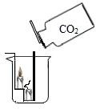

**答案：** D.

---

### TK-C9-U6-002
| 字段 | 内容 |
|------|------|
| 章节 | 第六单元-碳和碳的氧化物 |
| 来源 | 中考同步+一轮讲义 |
| 题型 | 选择题 |

**题目：** 木炭和活性炭都具有很强的吸附能力，是由于（）A．都是无定形碳B．其碳原子的排列方式不同C．它们的密度小D．都是疏松多孔，表面积大
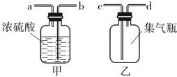

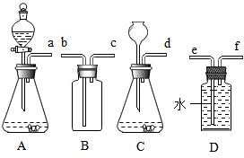

**答案：** D

---

### TK-C9-U6-003
| 字段 | 内容 |
|------|------|
| 章节 | 第六单元-碳和碳的氧化物 |
| 来源 | 中考同步+一轮讲义 |
| 题型 | 填空题 |

**题目：** 物质的用途与性质对应关系不．合．理．的是()A．石墨作电池电极——导电性B．焦炭冶炼金属——可燃性C．金刚石切割玻璃——硬度大D．活性炭除异味——吸附性

**答案：** B

---

### TK-C9-U6-004
| 字段 | 内容 |
|------|------|
| 章节 | 第六单元-碳和碳的氧化物 |
| 来源 | 中考同步+一轮讲义 |
| 题型 | 填空题 |

**题目：** 物质的性质决定用途。下列因果关系不成立的是 A．因为金刚石硬度大，所以可用于刻玻璃B．因为氧气能助燃，所以可用作燃料C．因为红磷燃烧产生大量白烟，所以可用于制作烟幕弹 D．因为氮气化学性质稳定，所以可用于食品包装袋内防腐
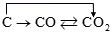

**答案：** B

---

### TK-C9-U6-005
| 字段 | 内容 |
|------|------|
| 章节 | 第六单元-碳和碳的氧化物 |
| 来源 | 中考同步+一轮讲义 |
| 题型 | 选择题 |

**题目：** 如图为金刚石、石墨  和 C60 的结构模型图，图中小球代表碳原子。下列说法不正确的是A．原子的排列方式改变，则构成的物质种类改变B．相同元素组成的不同碳单质，在足量的氧气中充分燃烧，产物相同 C．金刚石、石墨和 C60 都是由碳原子直接构成的单质D．在特定的条件下，石墨可转化为金刚石，是化学变化

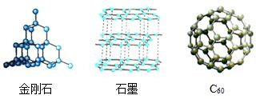

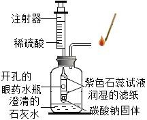

**答案：** C

---

### TK-C9-U6-006
| 字段 | 内容 |
|------|------|
| 章节 | 第六单元-碳和碳的氧化物 |
| 来源 | 中考同步+一轮讲义 |
| 题型 | 选择题 |

**题目：** 下列物质的用途及其依据的性质对应正确的是A．金刚石用于制造钻石——金刚石硬度大B．石墨用作电池的电极——石墨是一种黑色固体 C．氮气作粮食瓜果的保护气——氮气化学性质稳定 D．氧气可用于医疗急救——氧气具有助燃性
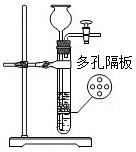

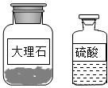

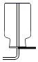

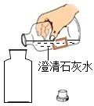

**答案：** C

---

### TK-C9-U6-007
| 字段 | 内容 |
|------|------|
| 章节 | 第六单元-碳和碳的氧化物 |
| 来源 | 中考同步+一轮讲义 |
| 题型 | 选择题 |

**题目：** 炼铁炉中某反应的微观示意图(不同的球代表不同的原子)如下图所示，下列说法不正确的是A．该反应属于化合反应B．该反应表示 CO2 与 C 反应生成 COC．反应中共有三种化合物D．反应前后分子的种类发生了变化高温
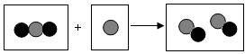

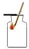

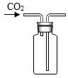

**答案：** C

---

### TK-C9-U6-008
| 字段 | 内容 |
|------|------|
| 章节 | 第六单元-碳和碳的氧化物 |
| 来源 | 中考同步+一轮讲义 |
| 题型 | 选择题 |

**题目：** 在高温条件下，碳能使二氧化碳转变成一氧化碳：C+CO2====2CO，下列说法不正确的是A．反应中碳发生了还原反应 B．产物是空气污染物之一 C．该反应为吸热反应D．该反应中原子数目在反应前后不变
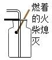

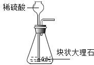

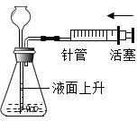

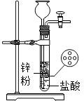

**答案：** A

---

### TK-C9-U6-009
| 字段 | 内容 |
|------|------|
| 章节 | 第六单元-碳和碳的氧化物 |
| 来源 | 中考同步+一轮讲义 |
| 题型 | 填空题 |

**题目：** 碳在氧气中燃烧由于二者的质量比不同，产生的产物也不同，若生成物为 CO 和 CO2 的混合物，则碳和氧气的质量比可能是A．3：4B．3：5C．3：6D．3：8高温
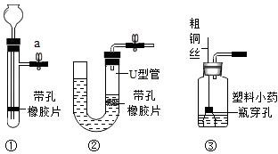

**答案：** BC

---

### TK-C9-U6-010
| 字段 | 内容 |
|------|------|
| 章节 | 第六单元-碳和碳的氧化物 |
| 来源 | 中考同步+一轮讲义 |
| 题型 | 计算题 |

**题目：** 已知：C+2CuO====2Cu+CO2↑。如图表示一定量的木炭和氧化铜固体混合物受热过程中，某变量 y 随加热时间的变化趋势，其中纵坐标 y 表示A．固体的质量B．固体中氧化铜的质量 C．二氧化碳的质量D．固体中铜元素的质量分数
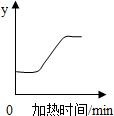

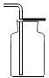

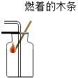

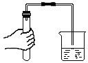

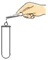

**答案：** D

---

### TK-C9-U6-011
| 字段 | 内容 |
|------|------|
| 章节 | 第六单元-碳和碳的氧化物 |
| 来源 | 中考同步+一轮讲义 |
| 题型 | 计算题 |

**题目：** 为探究 CuO 和 C 反应的最佳质量比（忽略其它副反应），化学兴趣小组按如图一所示装置，取 CuO 和 C 的混合物 17.2g，按不同的质量比进行实验，实验结果如图二所示。以下说法不．正．确．的是①实验过程中，观察到黑色固体变红，说明反应己经结束②实验结束时应先将导管移出水面，再熄灭酒精灯③该反应中氧化铜发生了还原反应，反应前后只有氧元素的化合价没有发生改变④反应前后铜元素在固体中的质量分数不变⑤CuO 和 C 的最佳质量比对应图二中的 b 点⑥a 点时，反应消耗的 C 的质量为 9.2g，CuO 的质量为 8g⑦c 点对应的原固体中 CuO 和 C 的质量分别为 17.2g、0gA
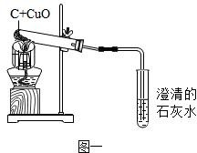

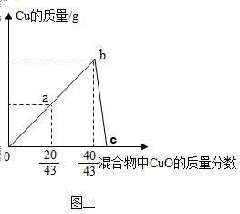

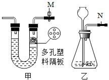

**答案：** C

---

### TK-C9-U6-012
| 字段 | 内容 |
|------|------|
| 章节 | 第六单元-碳和碳的氧化物 |
| 来源 | 中考同步+一轮讲义 |
| 题型 | 选择题 |

**题目：** 已知：2CuO+C====2Cu+CO2↑。如图表示一定质量的 CuO 和 C 固体混合物在受热过程中各物质质量随时间的变化趋势。下列说法中，不正确的是A．t1 时，开始发生反应B．t1 和 t2 时，固体中铜元素质量保持不变C．c 是固体混合物的质量D．d 是二氧化碳的质量
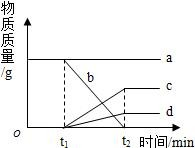

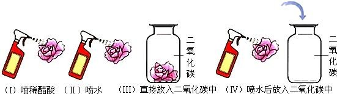

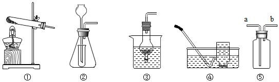

**答案：** C

---

### TK-C9-U6-013
| 字段 | 内容 |
|------|------|
| 章节 | 第六单元-碳和碳的氧化物 |
| 来源 | 中考同步+一轮讲义 |
| 题型 | 计算题 |

**题目：** C60 可用作吸氢材料，其原理是 C60 与 H2 在一定条件下反应生成氢化物；该氢化物在 80～215℃时，会分解放出 H2 在．C60 属于（填字母序号）．A．单质B．化合物C．混合物求算 C60 的相对分子质量的计算式为．C60  可用作吸氢材料是利用了其（填“物理”或“化学”）性质．
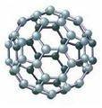

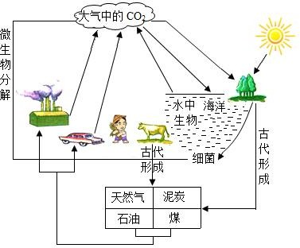

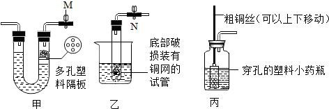

**答案：** (1) A；(2) 12×60；(3) 化学.

---

### TK-C9-U6-014
| 字段 | 内容 |
|------|------|
| 章节 | 第六单元-碳和碳的氧化物 |
| 来源 | 中考同步+一轮讲义 |
| 题型 | 填空题 |

**题目：** 某同学设计了如图实验装置，进行碳的还原性的性质验证，对实验进行分析并回答：检查装置气密性的方法：将导管一端浸入水中，用手握住试管，若观察到水中导管口，说明装置气密性良好。酒精灯加上网罩的作用是。该实验的两个主要现象是，。CuO 发生反应(填“氧化”或“还原”)。左边试管中发生反应的化学方程式为：。实验结束后，应该先撤出导气管，再停止加热，原因是。
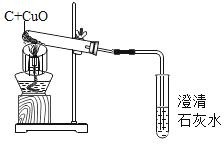

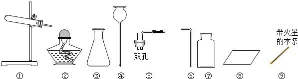

**答案：** （1）有气泡冒出使火焰集中，提高温度（3）黑色粉末逐渐变成光亮的红色澄清的石灰水变浑高温浊（4）还原（5） C+2CuO2Cu+CO2  （6）防止石灰水倒流，使试管炸裂。

---

### TK-C9-U6-015
| 字段 | 内容 |
|------|------|
| 章节 | 第六单元-碳和碳的氧化物 |
| 来源 | 中考同步+一轮讲义 |
| 题型 | 填空题 |

**题目：** 某研究小组利用下图所示装置探究碳的氧化物的性质（固定装置略）．写出装置 A 中发生反应的化学方程式；装置 B 的作用是，装置 C 中可观察到的现象是．装置 D 玻璃管中发生反应的化学方程式，观察到的现象是．装置 E 的作用是，本实验还应在装置之间添加装置 E．从保护环境的角度分析，本实验的不足是，改进的方法是．
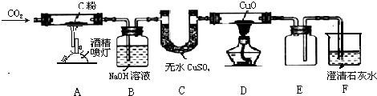

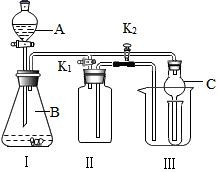

**答案：** (1) CO2+C2CO，吸收二氧化碳，白色固体变蓝色；(2) CuO+CO Cu+CO2，黑色固体变红色；(3) 安全瓶，能防液体倒吸到加热的试管中；AB；(4) 没有尾气吸收装置；把 F 装置改为既能检验二氧化碳气体，又能收集（或处理）一氧化碳的装置．

---

### TK-C9-U6-016
| 字段 | 内容 |
|------|------|
| 章节 | 第六单元-碳和碳的氧化物 |
| 来源 | 中考同步+一轮讲义 |
| 题型 | 填空题 |

**题目：** 某化学兴趣小组的同学探究木炭还原氧化铜的实验，实验装置如图。实验时，a 中的固体由黑色变红色，b 中的试管内产生气泡和白色沉淀。【査阅资料】氧化亚铜（Cu2O）是红色固体，能与稀硫酸发生如下反应：Cu2O＋H2SO4＝Cu＋CuSO4＋H2O。【提出问题】已知实验后 a 中的红色固体含有单质铜，是否还含有氧化亚铜（Cu2O）呢？【实验验证】取 a 中的红色固体少量于试管中，加入溶液，试管中出现，证明固体中确实含有 Cu2O。【提出问题】木炭还原氧化铜产生的气体是什么？【提出猜想】猜想一：CO2；猜想二：CO；猜想三：。【提出质疑】甲同学认为猜想二不正确，他的理由是。【验证猜想】乙同学将木
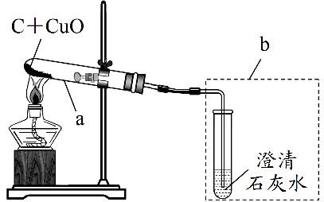

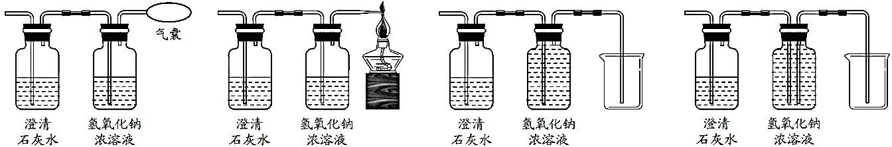

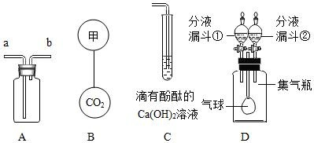

**答案：** 【实验验证】稀硫酸；固体部分溶解，溶液由无色变成蓝色；【提出猜想】CO2 和 CO；【提出质疑】仅有一氧化碳时不能使澄清石灰水变浑浊；高温【验证猜想】三；CO＋CuO====Cu＋CO2；【交流反思】A 或 B 或 D。

---

### TK-C9-U6-017
| 字段 | 内容 |
|------|------|
| 章节 | 第六单元-碳和碳的氧化物 |
| 来源 | 中考同步+一轮讲义 |
| 题型 | 填空题 |

**题目：** 如图所示实验能够说明二氧化碳具有的性质有()①不能燃烧 ②不能支持燃烧 ③还原性 ④密度比空气大 ⑤密度比空气小A．①②③B．②③④C．①②④D．①②⑤

**答案：** C.

---

### TK-C9-U6-018
| 字段 | 内容 |
|------|------|
| 章节 | 第六单元-碳和碳的氧化物 |
| 来源 | 中考同步+一轮讲义 |
| 题型 | 选择题 |

**题目：** 固态二氧化碳又名干冰，下列关于干冰的说法错误的是（ ）A．干冰不是冰B．干冰可用于人工降雨C．干冰做制冷剂利用的是其化学性质D．干冰可用于制造舞台烟雾效果

**答案：** C

---

### TK-C9-U6-019
| 字段 | 内容 |
|------|------|
| 章节 | 第六单元-碳和碳的氧化物 |
| 来源 | 中考同步+一轮讲义 |
| 题型 | 填空题 |

**题目：** 一氧化碳是一种无色、无味但有剧毒的气体，其密度与空气很接近，难溶于水．现要收集一瓶一氧化碳气体，可采用的方法是（  ）向下排空气法B．向上排空气法C．排水法D．向上排空气法或排水法

**答案：** C

---

### TK-C9-U6-020
| 字段 | 内容 |
|------|------|
| 章节 | 第六单元-碳和碳的氧化物 |
| 来源 | 中考同步+一轮讲义 |
| 题型 | 填空题 |

**题目：** C、CO 和 CO2 都是我们熟悉的物质，关于 C、CO 和 CO2 有以下说法：①一氧化碳具有可燃性，所以一氧化碳在工业上用来冶炼金属②二氧化碳不能供给呼吸，是因为二氧化碳有毒性③金刚石、石墨和 C60 三种单质不全由原子构成④将石墨转变为金刚石的变化过程为物理变化⑤二氧化碳通入紫色石蕊溶液，溶液变红色，说明二氧化碳具有酸性⑥通过化学反应，三者可实现如下转化其中正确的说法有（  ）个B．2 个C．3 个D．4 个

**答案：** B

---

### TK-C9-U6-021
| 字段 | 内容 |
|------|------|
| 章节 | 第六单元-碳和碳的氧化物 |
| 来源 | 中考同步+一轮讲义 |
| 题型 | 填空题 |

**题目：** 某化学兴趣小组用青霉素的药瓶、注射器和眼药水瓶设计了如图所示的实验装置，用于检验二氧化碳的性质．缓缓推动注射器活塞，滴入稀硫酸后，在眼药水瓶中即可产生二氧化碳气体，下列有关说法错．误．的是（  ）A. 该实验中不能用浓盐酸代替稀硫酸B. 上下两片滤纸条变红，只能证明 CO2 与水反应生成碳酸C.  该实验能验证二氧化碳不能燃烧，也不支持燃烧D.   该微型实验具有所用药品量少，现象明显，操作简单等优点

**答案：** B

---

### TK-C9-U6-022
| 字段 | 内容 |
|------|------|
| 章节 | 第六单元-碳和碳的氧化物 |
| 来源 | 中考同步+一轮讲义 |
| 题型 | 选择题 |

**题目：** 鉴别空气、氧气和二氧化碳三瓶气体，最常用的方法是（ ）A．观察颜色B．将燃着的木条分别伸入集气瓶中C．分别测定它们的密度D．将气体分别通入澄清石灰水中

**答案：** B

---

### TK-C9-U6-023
| 字段 | 内容 |
|------|------|
| 章节 | 第六单元-碳和碳的氧化物 |
| 来源 | 中考同步+一轮讲义 |
| 题型 | 选择题 |

**题目：** 下列实验操作，不能达到实验目的是（ ）A．除去 CO2 中少量的 CO，将气体通过足量灼热的氧化铜 B．除去氧化铜中的木炭，隔绝空气加强热C．鉴别 O2 和 CO2，可以用燃着的木条检验 D．除去泥水中的泥沙，可以用过滤操作

**答案：** B

---

### TK-C9-U6-024
| 字段 | 内容 |
|------|------|
| 章节 | 第六单元-碳和碳的氧化物 |
| 来源 | 中考同步+一轮讲义 |
| 题型 | 选择题 |

**题目：** 下列变化不属于化学变化的是（ ）A．二氧化碳气体通过澄清的石灰水B．二氧化碳使紫色石蕊试液变红 C．二氧化碳制成干冰D．木炭还原氧化铜

**答案：** C

---

### TK-C9-U6-025
| 字段 | 内容 |
|------|------|
| 章节 | 第六单元-碳和碳的氧化物 |
| 来源 | 中考同步+一轮讲义 |
| 题型 | 选择题 |

**题目：** 分析下列化学反应，所得结论不正确的是（ ）点燃点燃点燃2C+O22CO ， C+O2CO2 ， 2CO+O22CO2A．上述转化都只能通过与氧气反应来实现B．反应物相同，参加反应的物质的质量不同时，生成物可能不同 C．上述反应的生成物都是氧化物D．碳、一氧化碳均具有还原性，可用于炼铁工业

**答案：** A

---

### TK-C9-U6-026
| 字段 | 内容 |
|------|------|
| 章节 | 第六单元-碳和碳的氧化物 |
| 来源 | 中考同步+一轮讲义 |
| 题型 | 选择题 |

**题目：** 现有只含 C、O 两种元素的气体样品 11g，测得其中含 C 元素 3g，则关于此样品的说法正确的是（）A．此样品可能是 CO2B．此样品组成只有两种情况C．此样品一定是 CO2 和 CO 气体组成的混合物D．若此样品含两种物质，则其中一种物质质量分数为  27.3%

**答案：** A

---

### TK-C9-U6-027
| 字段 | 内容 |
|------|------|
| 章节 | 第六单元-碳和碳的氧化物 |
| 来源 | 中考同步+一轮讲义 |
| 题型 | 选择题 |

**题目：** 对比是化学学习的一种重要方法。下列关于 CO2 与 CO 的比较，错误的是A．CO2 可用于人工降雨，CO 可用于光合作用B．通常状况下，CO2 能溶于水，CO 难溶于水C．CO2 无毒，CO  易与血液中的血红蛋白结合引起中毒D．一个 CO2 分子比一个 CO 分子多一个氧原子

**答案：** A

---

### TK-C9-U6-028
| 字段 | 内容 |
|------|------|
| 章节 | 第六单元-碳和碳的氧化物 |
| 来源 | 中考同步+一轮讲义 |
| 题型 | 选择题 |

**题目：** 为探究二氧化碳能否与水发生化学反应，用四朵石蕊溶液染成紫色的干燥小花完成如图四个实验。实验Ⅰ、Ⅳ中小花变红，实验Ⅱ、Ⅲ中小花不变色。下列说法不正确的是（）A．对比实验Ⅰ、Ⅱ说明醋酸可以使小花变红 B．实验Ⅲ说明二氧化碳不能使小花变红C．对比实验Ⅰ、Ⅳ说明二氧化碳和醋酸具有相似的化学性质 D．对比实验Ⅱ、Ⅲ、Ⅳ说明二氧化碳能与水发生化学反应

**答案：** C

---

### TK-C9-U6-029
| 字段 | 内容 |
|------|------|
| 章节 | 第六单元-碳和碳的氧化物 |
| 来源 | 中考同步+一轮讲义 |
| 题型 | 填空题 |

**题目：** 如图是自然界中碳循环的示意图，回答下列问题：据图分析，自然界中碳循环主要通过（填物质名称）进行实现。根据图中所示，产生二氧化碳的一种途径。海水吸收也是自然界中二氧化碳消耗的一种重要途径，二氧化碳和水反应的化学式表达式为          。绿色植物的光合作用能将二氧化碳和水转化为葡萄糖（C6H12O6）和氧气，反应是将          能转化为化学能。由以上两个反应可以看出，即使反应物相同，但如果           不同，反应产物也可能不同。据统计，大气中每年新增二氧化碳约为 185～242 亿吨，而其综合利用还不足 1 亿吨/年。二氧化碳含量升高会导致的一种环境问题是 。

**答案：** （1）二氧化碳（2）动物的呼吸作用，微生物的分解或化石燃料的燃烧CO2+H2O→H2CO3光条件（4）温室效应加剧

---

### TK-C9-U6-030
| 字段 | 内容 |
|------|------|
| 章节 | 第六单元-碳和碳的氧化物 |
| 来源 | 中考同步+一轮讲义 |
| 题型 | 选择题 |

**题目：** 实验室制取二氧化碳时，应选用的反应物是（）A．大理石和稀盐酸B．大理石和浓盐酸C．碳酸钠和稀盐酸D．大理石和稀硫酸

**答案：** A

---

### TK-C9-U6-031
| 字段 | 内容 |
|------|------|
| 章节 | 第六单元-碳和碳的氧化物 |
| 来源 | 中考同步+一轮讲义 |
| 题型 | 选择题 |

**题目：** 实验室为了收集干燥的二氧化碳气体，让制取的气体先后经过甲、乙两装置。下列关于甲、乙两装置导管的连接方式正确的是()A．a 接 cB．a 接 dC．b 接 cD．b 接 d小棣尝试利用如图所示装置制取和收集一瓶 O2 或 CO2。你认为正确的操作应该是A．选择 CD 装置制取和收集一瓶 O2，连接 dfB．选择 AD 装置制取和收集一瓶 O2，连接 afC．选择 BC 装置制取和收集一瓶 CO2，连接 dbD．选择 AB 装置制取和收集一瓶 CO2，连接 ac

**答案：** A.

---

### TK-C9-U6-032
| 字段 | 内容 |
|------|------|
| 章节 | 第六单元-碳和碳的氧化物 |
| 来源 | 中考同步+一轮讲义 |
| 题型 | 选择题 |

**题目：** 实验室制取二氧化碳气体应选用的仪器是（ ）A．长颈漏斗、集气瓶、水槽、导气管B．集气瓶、试管、水槽、导气管C．酒精灯、广口瓶、集气瓶、长颈漏斗D．广口瓶、集气瓶、长颈漏斗、带导管的橡皮塞

**答案：** D

---

### TK-C9-U6-033
| 字段 | 内容 |
|------|------|
| 章节 | 第六单元-碳和碳的氧化物 |
| 来源 | 中考同步+一轮讲义 |
| 题型 | 选择题 |

**题目：** 下列有关实验室制取二氧化碳的方法不合理的是（）A．二氧化碳能溶于水也能与水反应，不可用排水法收集B．通常情况下二氧化碳密度大于空气，能用向上排空气法收集 C．在发生装置中加入块状石灰石和稀硫酸D．此反应在常温下即可迅速发生，故该气体发生装置不需要加热

**答案：** C

---

### TK-C9-U6-034
| 字段 | 内容 |
|------|------|
| 章节 | 第六单元-碳和碳的氧化物 |
| 来源 | 中考同步+一轮讲义 |
| 题型 | 选择题 |

**题目：** 有关实验室制取二氧化碳的过程正确的是A．原料B．发生装置C．收集装置D．验满

**答案：** B

---

### TK-C9-U6-035
| 字段 | 内容 |
|------|------|
| 章节 | 第六单元-碳和碳的氧化物 |
| 来源 | 中考同步+一轮讲义 |
| 题型 | 选择题 |

**题目：** 下列实验操作中，正确的是（）A．二氧化碳验满B．贮存二氧化碳气体C．排空气收集 CO2D．熄灭酒精灯

**答案：** D

---

### TK-C9-U6-036
| 字段 | 内容 |
|------|------|
| 章节 | 第六单元-碳和碳的氧化物 |
| 来源 | 中考同步+一轮讲义 |
| 题型 | 选择题 |

**题目：** 科学实验要规范操作，下列初中科学实验操作你认为正确的是A．CO2 的验满B．制取 CO2C．检验气密性D．实验室即关即停制取 H2

**答案：** C

---

### TK-C9-U6-037
| 字段 | 内容 |
|------|------|
| 章节 | 第六单元-碳和碳的氧化物 |
| 来源 | 中考同步+一轮讲义 |
| 题型 | 选择题 |

**题目：** 老师让同学们自己动脑、动手设计能随时控制反应发生或停止的制取二氧化碳的发生装置。如图所示是小明、小红、张强三位同学设计的装置，其中你认为符合要求的是（）A．①②③B．②C．①D．①③

**答案：** A。

---

### TK-C9-U6-038
| 字段 | 内容 |
|------|------|
| 章节 | 第六单元-碳和碳的氧化物 |
| 来源 | 中考同步+一轮讲义 |
| 题型 | 选择题 |

**题目：** 实验室中制取、收集 CO2，并验满，以下各步操作中正确的是（）A．检査气密性B．添加大理石C．收集D．验满

**答案：** C。

---

### TK-C9-U6-039
| 字段 | 内容 |
|------|------|
| 章节 | 第六单元-碳和碳的氧化物 |
| 来源 | 中考同步+一轮讲义 |
| 题型 | 选择题 |

**题目：** 甲乙是某同学设计的两套制取二氧化碳的发生装置，对两套装置分析不正确的是（）A．此时甲装置中的止水夹 M 处于关闭状态 B．甲装置气体导出过程中容器内外气压相等 C．甲装置优点可以控制化学反应的发生与停止D．乙装置 N 处添加止水夹可以与甲装置具有相同功能

**答案：** D。

---

### TK-C9-U6-040
| 字段 | 内容 |
|------|------|
| 章节 | 第六单元-碳和碳的氧化物 |
| 来源 | 中考同步+一轮讲义 |
| 题型 | 选择题 |

**题目：** 实验室用下列装置制取气体，下列有关说法错误的是A．装置①、④组合可用于氯酸钾、二氧化锰加热制取氧气B．装置②中锥形瓶内的小试管，在实验过程中起液封和节约药品的作用 C．装置③、⑤组合用于实验室制取二氧化碳，燃着的木条放在 a 管口处验满 D．装置③、④组合用于实验室制取氢气，说明氢气难溶于水

**答案：** C

---

### TK-C9-U6-041
| 字段 | 内容 |
|------|------|
| 章节 | 第六单元-碳和碳的氧化物 |
| 来源 | 中考同步+一轮讲义 |
| 题型 | 选择题 |

**题目：** 甲乙丙是某同学设计的三套制取二氧化碳的发生装置，对三套装置分析不正确的是（   ）A．此时甲装置中的止水夹 M 处于关闭状态B．甲装置气体导出过程中容器内外气压相等C．甲装置和丙装置具有可控制反应进行或停止的功能 D．乙装置 N 处添加止水夹可以与甲装置具有相同功能

**答案：** D

---

### TK-C9-U6-042
| 字段 | 内容 |
|------|------|
| 章节 | 第六单元-碳和碳的氧化物 |
| 来源 | 中考同步+一轮讲义 |
| 题型 | 选择题 |

**题目：** 下列实验中，仪器和用品的选择不合理的是（）收集 CO2 气体――⑥⑦⑧用 H2O2 溶液和 MnO2 制 O2――①② C．检验一瓶气体是否为 O2――⑦⑧⑨ D．用大理石和稀盐酸制 CO2――③④⑤

**答案：** B

---

### TK-C9-U6-043
| 字段 | 内容 |
|------|------|
| 章节 | 第六单元-碳和碳的氧化物 |
| 来源 | 中考同步+一轮讲义 |
| 题型 | 选择题 |

**题目：** 某研究性学习小组选择合适的药品和如图所示装置，既可制取气体，又可验证物质的性质。下列说法错误的是在实验室里，装置 I 可用作大理石和稀盐酸制取二氧化碳的发生装置当打开 K

**答案：** B

---

### TK-C9-U6-044
| 字段 | 内容 |
|------|------|
| 章节 | 第六单元-碳和碳的氧化物 |
| 来源 | 中考同步+一轮讲义 |
| 题型 | 填空题 |

**题目：** 某同学设计了如图所示的实验装置，用于 CO2 的收集和部分性质进行探究，请按要求回答问题。用 A 装置收集 CO2，气体应从（选填“a”或“b”）端通入。若要 B 中的两个气体悬浮在空气中，则气体甲可能是（选填字母）。氢气B．氧气C．空气往 C 试管中通入 CO2，当出现 现象，表示石灰水中的溶质恰好完全沉淀。（酚酞遇到 Ca(OH)2 变红）（4）D 装置的集气瓶中充满 CO2，当打开分液漏斗①，滴入少量 NaOH 浓溶液，气球明显胀大，写出化学方程式：  ；若要气球恢复原状，应关闭分液漏斗①，打开分液漏斗②，滴入溶液（填化学式，忽略滴入液体的体积）（5）天然溶洞中形态各异的石笋和钟乳

**答案：** （1）a；（2）A；（3）溶液红色刚好消失；（4）CO2+2NaOH=Na2CO3+H2O；HCl 或 H2SO4；（5）H2O。

---

### TK-C9-U6-045
| 字段 | 内容 |
|------|------|
| 章节 | 第六单元-碳和碳的氧化物 |
| 来源 | 中考同步+一轮讲义 |
| 题型 | 填空题 |

**题目：** 如图 1 是实验室制取 CO2 及进行性质实验的部分装置。CaCO3 固体与稀盐酸反应生成 CO2 气体的化学方程式是。检验装置气密性，按图连接装置，先，再加水至 A 下端形成一段水柱，静置，若观察到，说明气密性良好。加入药品。添加块状 CaCO3 固体时，为避免打破锥形瓶，应将锥形瓶，再放入固体。添加盐酸时，将稀盐酸从（填仪器 A 的名称）倒入锥形瓶至。如图 2 所示，向放置有燃着的蜡烛的烧杯中倒入 CO2，观察到的现象是。
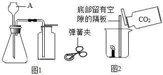

**答案：** （1）CaCO3 +2HCl＝CaCl2+H2O+CO2↑夹紧止水夹长颈漏斗内水柱不下降横放长颈漏斗浸没长颈漏斗下端口蜡烛熄灭

---

### TK-C9-U6-046
| 字段 | 内容 |
|------|------|
| 章节 | 第六单元-碳和碳的氧化物 |
| 来源 | 中考同步+一轮讲义 |
| 题型 | 填空题 |

**题目：** 下列装置常用于实验室制取气体。根据给出的装置回答下列问题：指出编号仪器名称：①；实验室利用 A 装置制取氧气的化学方程式为：；其中 A 装置有一处错误是；利用 C 装置开始收集氧气的最佳时刻是：，最后观察到即表示收集满了。实验室制取二氧化碳的化学方程式为：，选 B 装置作为反应发生装置的优点是，产生的二氧化碳气体可能混有哪些杂质：；若用 F 装置收集二氧化碳时，气体应从（填导管两端的字母）端进入。
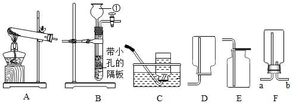

**答案：** 长颈漏斗2KMnO4 ΔK2MnO4+MnO2+O2↑试管口没有棉花气泡均匀而连续时瓶口有气泡冒出CaCO3 + 2HCl==CaCl2 + CO2↑ + H2O便于控制反应的开与关水蒸气、氯化氢气体b

---

### TK-C9-U6-047
| 字段 | 内容 |
|------|------|
| 章节 | 第六单元-碳和碳的氧化物 |
| 来源 | 中考同步+一轮讲义 |
| 题型 | 填空题 |

**题目：** 实验室制取气体所需的装置如下图所示，请回答下列问题。装置 B 中标号①仪器的名称是。图中的四个气体收集装置中，有一个是错误的，则这个装置是(填字母)。实验室用高锰酸钾制取少量氧气的化学方程式为，若用装置 A 和 C 制取并收集氧气，则要对 A 进行的改进是，证明氧气是否收集满的实验操作方法是。实验室要制取少量的二氧化碳，需用的发生和收集装置的常用组合为(填字母)。用化学方程式表示检验二氧化碳气体的方法是。通常情况下，甲烷是一种无色无味的气体，难溶于水，密度比空气小。实验室用醋酸钠和碱石灰两种固体混合加热制得甲烷气体。制取甲烷的发生装置可选用(填字母)，若用 F 收集该气体，应该从端进气(
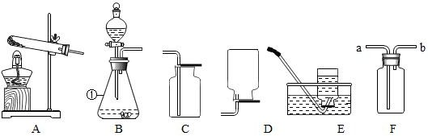

**答案：** （1）锥形瓶D△（2）2KMnO4===K2MnO4+MnO2+O2↑在试管口放一团棉花将带火星的木条放于瓶口，若木条复燃，则氧气已集满（3）BCCO2 +Ca(OH)2＝CaCO3↓+ H2O（4）Ab

---

## 题目数量统计
| 来源 | 题目数 |
|------|--------|
| 中考同步+一轮讲义 | 47 |
| 合计 | 47 |
