# 第十一单元-化学与社会 — 题库

> 来源：中考化学同步+一轮讲义 | 标注格式：TK-C9-U11-题序号

---

### TK-C9-U11-001
| 字段 | 内容 |
|------|------|
| 章节 | 第十一单元-化学与社会 |
| 来源 | 中考同步+一轮讲义 |
| 题型 | 选择题 |

**题目：** 下列食物富含蛋白质的是（）A．鸡蛋B．米饭C．白菜D．西瓜

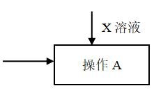

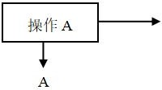

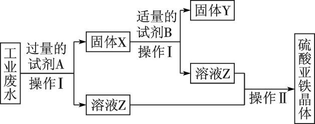

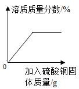

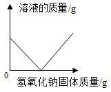

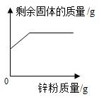

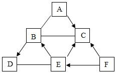

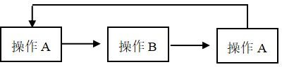

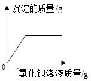

**答案：** A

---

### TK-C9-U11-002
| 字段 | 内容 |
|------|------|
| 章节 | 第十一单元-化学与社会 |
| 来源 | 中考同步+一轮讲义 |
| 题型 | 选择题 |

**题目：** 下列食物中，富含维生素的是（）A．  蔬菜B．羊肉C．米饭D．牛油

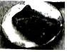

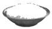

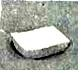

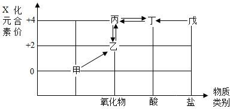

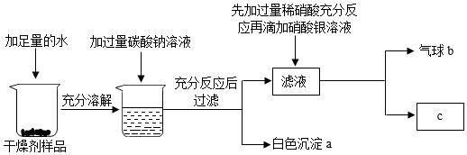

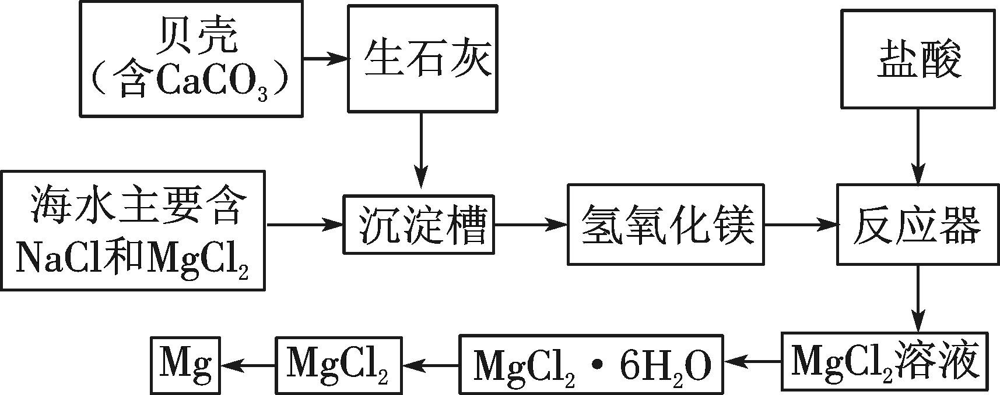

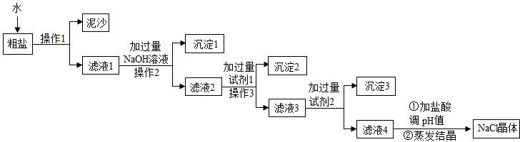

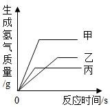

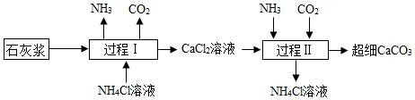

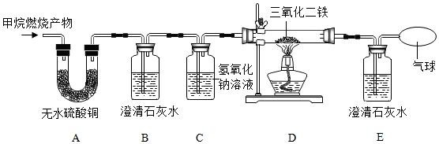

**答案：** A

---

### TK-C9-U11-003
| 字段 | 内容 |
|------|------|
| 章节 | 第十一单元-化学与社会 |
| 来源 | 中考同步+一轮讲义 |
| 题型 | 选择题 |

**题目：** 化学元素与我们的身体健康密切相关。缺铁易引发的疾病是（）A．夜盲症B．甲状腺肿大C．贫血D．骨质疏松

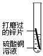

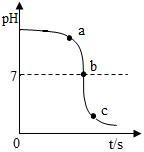

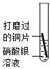

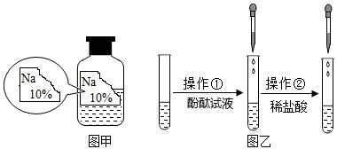

**答案：** C

---

### TK-C9-U11-004
| 字段 | 内容 |
|------|------|
| 章节 | 第十一单元-化学与社会 |
| 来源 | 中考同步+一轮讲义 |
| 题型 | 选择题 |

**题目：** 长期受电磁辐射可引起人头昏、头痛、失眠等症，科学家发现富含维生素的食物具有较好的防辐射损伤功能。下列食物中富含维生素的是（）A．油菜B．牛奶C．豆腐D．米饭
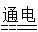

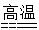

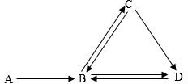

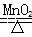

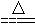

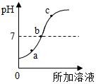

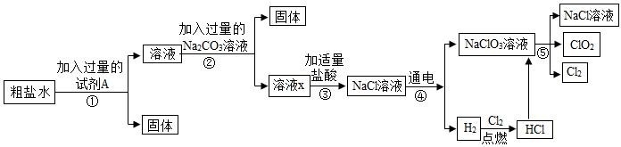

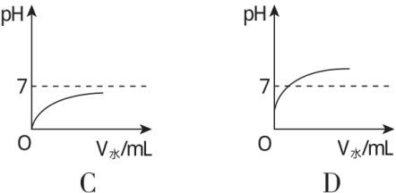

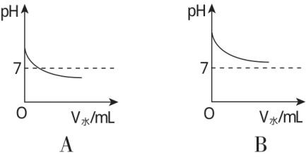

**答案：** A

---

### TK-C9-U11-005
| 字段 | 内容 |
|------|------|
| 章节 | 第十一单元-化学与社会 |
| 来源 | 中考同步+一轮讲义 |
| 题型 | 选择题 |

**题目：** 下列人体所必需的元素中，缺乏会引起贫血的是（）A．铁B．钙C．碘D．锌

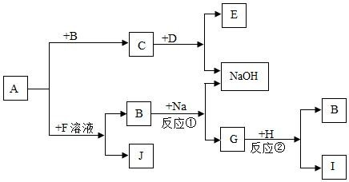

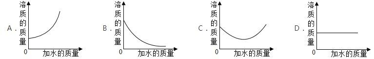

**答案：** A

---

### TK-C9-U11-006
| 字段 | 内容 |
|------|------|
| 章节 | 第十一单元-化学与社会 |
| 来源 | 中考同步+一轮讲义 |
| 题型 | 选择题 |

**题目：** 央视 315 晚会曝光辣条食品问题后，食品安全再次引起人们的高度关注。下列有关加工食品的做法合理的是（）A．霉变大米蒸煮后食用 B．用纯碱制作花卷C．用甲醛溶液浸泡海鲜产品D．用亚硝酸钠腌制蔬菜
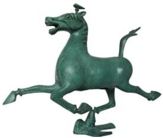

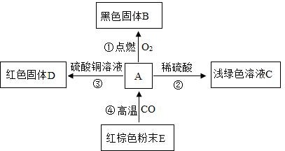

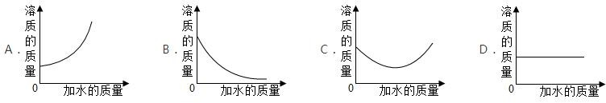

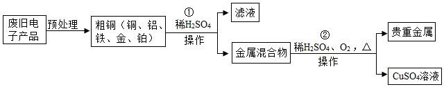

**答案：** B

---

### TK-C9-U11-007
| 字段 | 内容 |
|------|------|
| 章节 | 第十一单元-化学与社会 |
| 来源 | 中考同步+一轮讲义 |
| 题型 | 选择题 |

**题目：** “一日之计在于晨”，新的一天从营养丰富的早餐开始。下列食物富含蛋白质的是（）A．玉米、红薯B．鲜奶、豆浆C．苹果、西红柿D．牛油、奶油
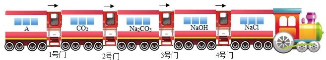

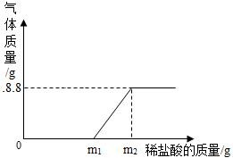

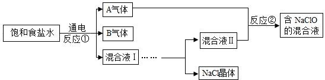

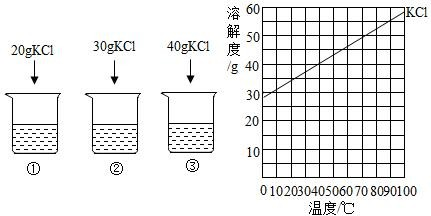

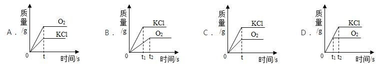

**答案：** B

---

### TK-C9-U11-008
| 字段 | 内容 |
|------|------|
| 章节 | 第十一单元-化学与社会 |
| 来源 | 中考同步+一轮讲义 |
| 题型 | 选择题 |

**题目：** 儿童体内缺少锌元素，严重时易患的疾病是（ ） A．佝偻病B．贫血症C．侏儒症D．甲状腺疾病

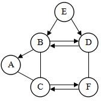

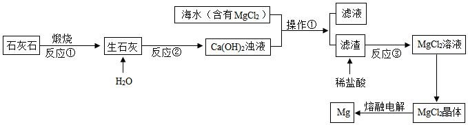

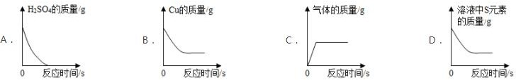

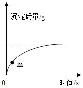

**答案：** C

---

### TK-C9-U11-009
| 字段 | 内容 |
|------|------|
| 章节 | 第十一单元-化学与社会 |
| 来源 | 中考同步+一轮讲义 |
| 题型 | 选择题 |

**题目：** 下列有关化学与安全的说法正确的是（）A．稀释浓硫酸时，将水直接倒入浓硫酸中 B．用甲醛溶液浸泡海鲜防腐C．误服重金属盐可用鸡蛋清解毒 D．直接进入久未开启的地窖

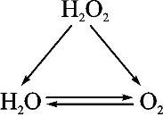

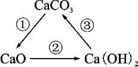

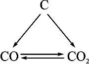

**答案：** C

---

### TK-C9-U11-010
| 字段 | 内容 |
|------|------|
| 章节 | 第十一单元-化学与社会 |
| 来源 | 中考同步+一轮讲义 |
| 题型 | 选择题 |

**题目：** 微量元素在人体内的质量总和不到人体质量的千分之一，但这些元素对人体的正常发育和健康起着重要作用。下列各元素全部属于人体中微量元素的是（）A．Na、Cl、OB．H、O、N C．N、Ca、CD．I、Fe、Zn

**答案：** D

---

### TK-C9-U11-011
| 字段 | 内容 |
|------|------|
| 章节 | 第十一单元-化学与社会 |
| 来源 | 中考同步+一轮讲义 |
| 题型 | 选择题 |

**题目：** 下列人体所缺元素与引起的健康问题关系错误的是（）A．缺锌会使儿童智力低下 B．缺碘会引起龋齿C．缺钙会引起骨质疏松 D．缺铁会引起贫血

**答案：** B

---

### TK-C9-U11-012
| 字段 | 内容 |
|------|------|
| 章节 | 第十一单元-化学与社会 |
| 来源 | 中考同步+一轮讲义 |
| 题型 | 填空题 |

**题目：** 下列总结的化学知识有．错．误．的一组是（   ）A．安全常识B．生活知识瓦斯爆炸﹣甲烷引起假酒中毒﹣甲醇引起煤气中毒﹣一氧化碳引起爱护水资源﹣节约用水和防止水污染湿衣服晾干﹣分子在不断的运动活性炭净水﹣吸附作用C．物质的性质与用途D．元素与人体健康氢气作高能燃料﹣可燃性用墨书写字画﹣稳定性 浓硫酸作干燥剂﹣脱水性缺铁﹣贫血缺钙﹣骨质疏松缺氟﹣龋齿A．AB．BC．CD．D

**答案：** C

---

### TK-C9-U11-013
| 字段 | 内容 |
|------|------|
| 章节 | 第十一单元-化学与社会 |
| 来源 | 中考同步+一轮讲义 |
| 题型 | 选择题 |

**题目：** 下列人体所缺元素与引起的健康问题关系不正确的是（）A．缺钙会引起骨质疏松 B．缺碘会引起甲状腺疾病 C．缺铁会引起龋齿D．缺锌会导致儿童智力低下

**答案：** C

---

### TK-C9-U11-014
| 字段 | 内容 |
|------|------|
| 章节 | 第十一单元-化学与社会 |
| 来源 | 中考同步+一轮讲义 |
| 题型 | 填空题 |

**题目：** 生活处处皆化学。请回答下面的问题：蛋白质/g脂肪/g糖类/g矿物质/g维生素 C/mg钙磷钾大米6.70.9787136﹣﹣﹣0.05番茄0.60.328370.411牛奶3.13.56120900.11日常生活中合理膳食、均衡营养都需要了解一定的化学知识。大米、番茄和牛奶是生活中常见的食品，每 100g 食品中营养成分的含量如表：蛋白质/g脂肪/g糖类/g矿物质/g维生素 C/mg钙磷钾大米6.70.9787136﹣﹣﹣0.05番茄0.60.328370.411牛奶3.13.56120900.11上表中的钙、磷、铁指的是（填字母）。原子B．单质C．元素人体若缺少元素（填元素符号），则可

**答案：** （1）C（2）Ca（3）A（4）9：1：12酸性（5）变小瘦肉

---

### TK-C9-U11-015
| 字段 | 内容 |
|------|------|
| 章节 | 第十一单元-化学与社会 |
| 来源 | 中考同步+一轮讲义 |
| 题型 | 填空题 |

**题目：** 妈妈为小鹏准备了一份午餐：米饭、红烧肉、糖醋鱼、咸鸭蛋、豆腐汤、酸奶。请回答下列问题：为保证各种营养素的均衡摄入，午餐中还应补充的营养素是。做红烧肉时，油锅起火，妈妈立即盖上锅盖。其灭火原理是。午饭后，小鹏感到胃不舒服，服用含氢氧化铝的药物中和过多的胃酸，症状有所缓解。写出该反应的化学方程式 。废弃的酸奶袋等塑料垃圾会造成“白色污染”，请写出一条解决“白色污染”的措施。第二课时化学材料一、有机化合物有机物定义含碳元素的化合物叫做有机化合物，除  CO

**答案：** 维生素隔绝氧气（或空气）Al(OH)3  3HCl=AlCl3  3H2O购物时自带环保购物袋等

---

## 题目数量统计
| 来源 | 题目数 |
|------|--------|
| 中考同步+一轮讲义 | 15 |
| 合计 | 15 |
