# 第十单元-常见的酸碱盐 — 题库

> 来源：中考化学同步+一轮讲义 | 标注格式：TK-C9-U10-题序号

---

### TK-C9-U10-001
| 字段 | 内容 |
|------|------|
| 章节 | 第十单元-常见的酸碱盐 |
| 来源 | 中考同步+一轮讲义 |
| 题型 | 填空题 |

**题目：** 下列物质露置在空气中，质量会减少的是（  ）A．生石灰 B．苛性钠 C．浓硫酸 D．浓盐酸

**答案：** D

---

### TK-C9-U10-002
| 字段 | 内容 |
|------|------|
| 章节 | 第十单元-常见的酸碱盐 |
| 来源 | 中考同步+一轮讲义 |
| 题型 | 填空题 |

**题目：** 下列溶液能使紫色石蕊溶液变蓝色的是（  ）A．氨水B．氯化钠溶液C．稀硝酸D．硫酸钾溶液

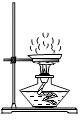

**答案：** A

---

### TK-C9-U10-003
| 字段 | 内容 |
|------|------|
| 章节 | 第十单元-常见的酸碱盐 |
| 来源 | 中考同步+一轮讲义 |
| 题型 | 选择题 |

**题目：** 取三张蓝色石蕊试纸放在玻璃上，然后按顺序分别滴加浓硝酸、浓硫酸、浓盐酸，三张试纸最后呈现的颜色是（）A．白、红、白B．红、黑、红C．红、红、红D．白、黑、红
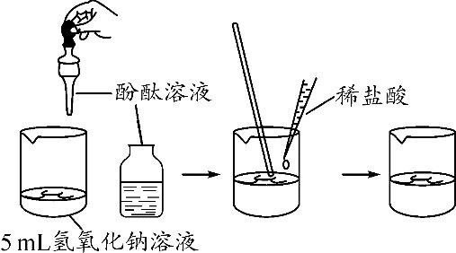

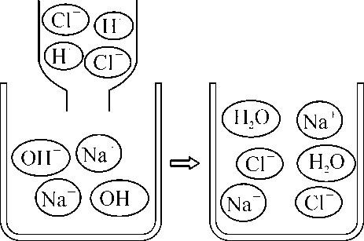

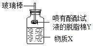

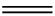

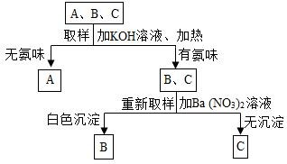

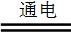

**答案：** D

---

### TK-C9-U10-004
| 字段 | 内容 |
|------|------|
| 章节 | 第十单元-常见的酸碱盐 |
| 来源 | 中考同步+一轮讲义 |
| 题型 | 选择题 |

**题目：** 浓盐酸敞口时能闻到刺激性气味，说明浓盐酸具有（）A．挥发性B．腐蚀性C．吸水性D．酸性
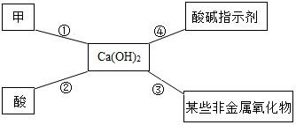

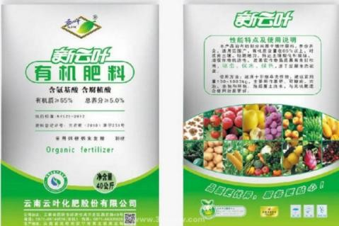

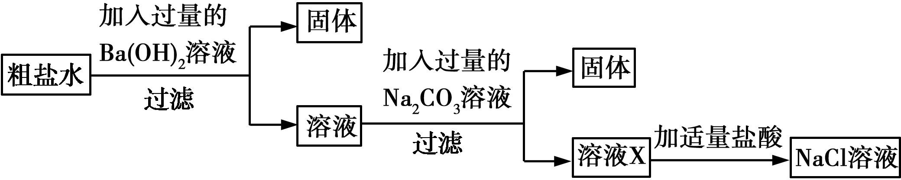

**答案：** A

---

### TK-C9-U10-005
| 字段 | 内容 |
|------|------|
| 章节 | 第十单元-常见的酸碱盐 |
| 来源 | 中考同步+一轮讲义 |
| 题型 | 选择题 |

**题目：** 下列是生活中常见物质的 pH 范围，显碱性的是（）A．葡萄汁（3.5～4.5）B．鸡蛋清（7.6～8.0）C．纯牛奶（6.3～6.6）D．苹果汁（2.9～3.3）
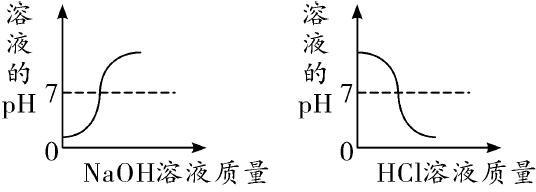

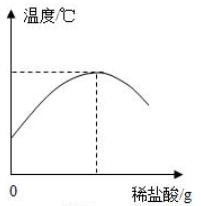

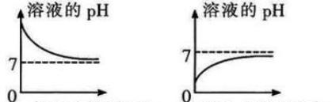

**答案：** B

---

### TK-C9-U10-006
| 字段 | 内容 |
|------|------|
| 章节 | 第十单元-常见的酸碱盐 |
| 来源 | 中考同步+一轮讲义 |
| 题型 | 选择题 |

**题目：** 一些物质的近似 pH 如图所示，下列有关说法正确的是（）A．鸡蛋清的碱性比肥皂水的碱性强 B．厕所清洁剂不会腐蚀大理石地面C．人被蚊虫叮咬后，在肿包处涂抹牛奶就可减轻痛痒 D．厕所清洁剂与炉具清洁剂不能混合使用
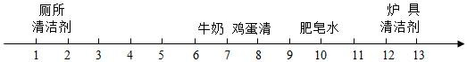

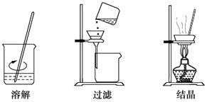

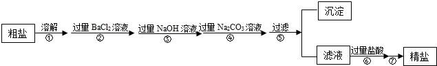

**答案：** D

---

### TK-C9-U10-007
| 字段 | 内容 |
|------|------|
| 章节 | 第十单元-常见的酸碱盐 |
| 来源 | 中考同步+一轮讲义 |
| 题型 | 选择题 |

**题目：** 为保证实验顺利进行，必须掌握一定的化学实验基本操作技能，下列操作正确的是（）A．点燃酒精灯B．稀释浓硫酸C．取用液体药瓶D．称量氢氧化钠
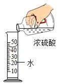

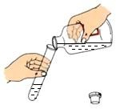

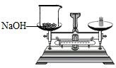

**答案：** D

---

### TK-C9-U10-008
| 字段 | 内容 |
|------|------|
| 章节 | 第十单元-常见的酸碱盐 |
| 来源 | 中考同步+一轮讲义 |
| 题型 | 选择题 |

**题目：** 下列关于实验现象描述不正确的是（）A．打开盛有浓盐酸的试剂瓶盖，瓶口上方会出现白雾 B．镁条在空气中燃烧发出耀眼的白光，生成白色固体C．将空气中燃着的硫粉伸入氧气瓶中，火焰由黄色变为蓝紫色D．把生锈的铁钉放入足量的稀盐酸中，溶液先由无色变为黄色，一段时间后有气泡生成

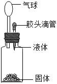

**答案：** C

---

### TK-C9-U10-009
| 字段 | 内容 |
|------|------|
| 章节 | 第十单元-常见的酸碱盐 |
| 来源 | 中考同步+一轮讲义 |
| 题型 | 选择题 |

**题目：** 在①氧化铁②金属锌③氢氧化铜④氯化钡溶液四种物质中，跟稀硫酸、稀盐酸都能发生反应且反应中表现了“酸的通性”的组合是（）A．①②③④B．①②③C．①③④D．②③④
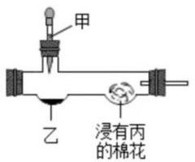

**答案：** B

---

### TK-C9-U10-010
| 字段 | 内容 |
|------|------|
| 章节 | 第十单元-常见的酸碱盐 |
| 来源 | 中考同步+一轮讲义 |
| 题型 | 选择题 |

**题目：** 下列性质中属于物理性质的是（）A．盐酸可以除去铁锈B．盐酸能使紫色石蕊溶液变红 C．浓盐酸在空气中易形成白雾D．盐酸遇金属铁会放出气体

**答案：** C

---

### TK-C9-U10-011
| 字段 | 内容 |
|------|------|
| 章节 | 第十单元-常见的酸碱盐 |
| 来源 | 中考同步+一轮讲义 |
| 题型 | 选择题 |

**题目：** 向盛有一定质量表面被氧化的镁条的烧杯中，慢慢加入一定浓度的盐酸。下列能正确反映其对应变化关系的是（）A． B．C． D．
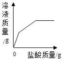

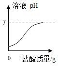

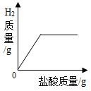

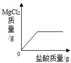

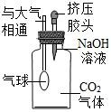

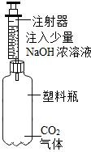

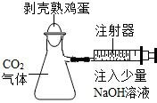

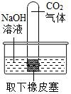

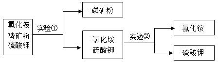

**答案：** C

---

### TK-C9-U10-012
| 字段 | 内容 |
|------|------|
| 章节 | 第十单元-常见的酸碱盐 |
| 来源 | 中考同步+一轮讲义 |
| 题型 | 选择题 |

**题目：** 实验室的浓硫酸、浓盐酸敞口放置一段时间后，如图象描述正确的是（）A．B．C．D．
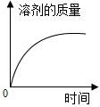

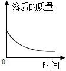

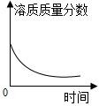

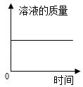

**答案：** C

---

### TK-C9-U10-013
| 字段 | 内容 |
|------|------|
| 章节 | 第十单元-常见的酸碱盐 |
| 来源 | 中考同步+一轮讲义 |
| 题型 | 填空题 |

**题目：** 某同学在实验探究中发现了一些物质之间发生化学反应的颜色变化，如图所示。编号①反应的指示剂是；编号②反应的金属单质是。根据如图可以总结出稀盐酸的化学性质，其中编号②反应的基本反应类型是反应。请你写出符合编号③反应的化学方程式。假设编号④反应的盐是 AgNO3，则编号④对应方框中的现象是。
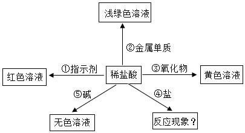

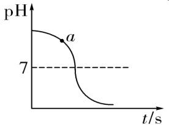

**答案：** （1）紫色石蕊溶液；铁；（2）置换；（3）Fe2O3+6HCl═2FeCl3+3H2O；（4）产生白色沉淀。

---

### TK-C9-U10-014
| 字段 | 内容 |
|------|------|
| 章节 | 第十单元-常见的酸碱盐 |
| 来源 | 中考同步+一轮讲义 |
| 题型 | 填空题 |

**题目：** 下图为某学习小组在白色点滴板上进行的有关“酸和碱与指示剂反应”的探究实验。使用白色点滴板进行实验的优点是（答一点）。稀盐酸和稀硫酸都能使紫色的石蕊溶液变红，是因为在不同酸的溶液中都含有相同的离子；氢氧化钠溶液和氢氧化钙溶液都能使无色的酚酞溶液变红，是因为在不同碱的溶液中都含有相同的 离子。第二课时  碱的基本性质与中和反应一、碱的定义

**答案：** （1）药品的用量少，可节约药品或可以同时完成几个实验，便于观察比较（2）氢氢氧根

---

### TK-C9-U10-015
| 字段 | 内容 |
|------|------|
| 章节 | 第十单元-常见的酸碱盐 |
| 来源 | 中考同步+一轮讲义 |
| 题型 | 选择题 |

**题目：** 如图是室温下稀硫酸和氢氧化钠反应过程中的 pH  变化曲线。下列有关说法正确的是（）A．图中 X 是氢氧化钠B．图中 a 点的阴离子是 OH-C．向图中 c 点所示溶液中加入铁粉后，溶液中有气泡产生D．稀硫酸与氢氧化钠溶液反应的化学方程式为：H2SO4+2NaOH═Na2SO4+H2O

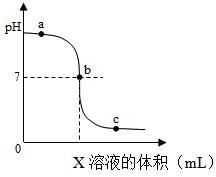

**答案：** C

---

### TK-C9-U10-016
| 字段 | 内容 |
|------|------|
| 章节 | 第十单元-常见的酸碱盐 |
| 来源 | 中考同步+一轮讲义 |
| 题型 | 选择题 |

**题目：** 将稀盐酸慢慢滴入氢氧化钠溶液中，溶液的温度随加入稀盐酸质量的变化如下图所示，下列说法不正确的是（）A．该反应是放热反应B．滴加过程中溶液的 pH 逐渐减小C．A  点处溶液中滴加酚酞溶液，溶液变红色D．B 点处溶液中含较多的 Na＋、OH－、Cl－、H＋

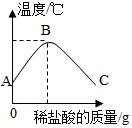

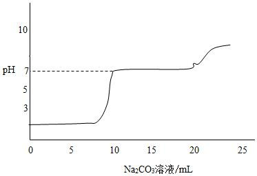

**答案：** D

---

### TK-C9-U10-017
| 字段 | 内容 |
|------|------|
| 章节 | 第十单元-常见的酸碱盐 |
| 来源 | 中考同步+一轮讲义 |
| 题型 | 选择题 |

**题目：** 实验小组用传感器探究稀 NaOH 溶液与稀盐酸反应过程中温度和 pH 的变化，测定结果如下图所示。下列说法不．正．确．的是（）A．反应过程中有热量放出B．30 s 时，溶液中溶质为 HCl 和 NaClC．从 20 s 到 40 s，溶液温度升高、pH 增大D．该实验是将稀盐酸滴入稀 NaOH 溶液中
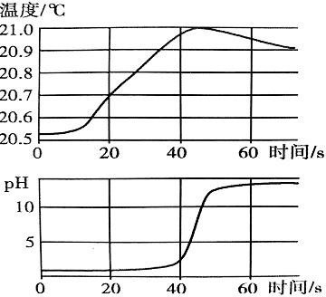

**答案：** D

---

### TK-C9-U10-018
| 字段 | 内容 |
|------|------|
| 章节 | 第十单元-常见的酸碱盐 |
| 来源 | 中考同步+一轮讲义 |
| 题型 | 选择题 |

**题目：** 化学兴趣小组在进行酸碱中和反应的课外研究时做了如下实验：向装有 50g 稀硫酸的小烧杯中，慢慢滴加 Ba(OH)2 溶液至过量，并测得反应过程中溶液的温度、电导率（是以数字表示的溶液传导电流能力）的变化曲线如图所示，下列说法正确的是（    ）A．该反应是吸热反应4B．稀硫酸能导电，是因为其溶液中有自由移动的 H+、SO 2- C．当加入质量为 m1g 的 Ba(OH)2 溶液时，溶液电导率最强 D．最终溶液电导率小于开始时稀硫酸的电导率419、25℃时，向 20.0mL 质量分数为 30%的盐酸中滴加氢氧化钠溶液，溶液的 pH 与所加氢氧化钠溶液的体积如图所示。下列有关叙述正确的是（）

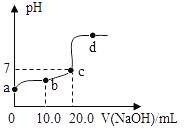

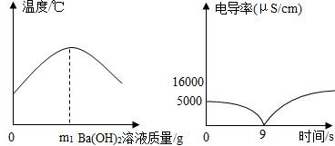

**答案：** B

---

### TK-C9-U10-019
| 字段 | 内容 |
|------|------|
| 章节 | 第十单元-常见的酸碱盐 |
| 来源 | 中考同步+一轮讲义 |
| 题型 | 选择题 |

**题目：** 向一定量  4%的氢氧化钠溶液中逐滴加入稀盐酸，有关分析错误的是（）．．．．ABCD．．．．
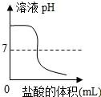

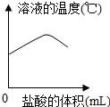

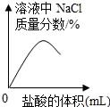

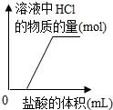

**答案：** D

---

### TK-C9-U10-020
| 字段 | 内容 |
|------|------|
| 章节 | 第十单元-常见的酸碱盐 |
| 来源 | 中考同步+一轮讲义 |
| 题型 | 填空题 |

**题目：** 小金通过图示装置验证 CO2 能与 NaOH 发生化学反应。推注射器活塞向充满 CO2 的集气瓶中注入过量 20%的 NaOH 溶液，振荡集气瓶后打开止水夹。打开止水夹后观察到的现象是。反应后将集气瓶中混合物过滤，所得溶液中除 CaCl2  外，还存在的溶质有。

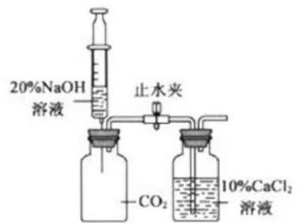

**答案：** （1）氯化钙溶液流入左边集气瓶中，并且溶液变浑浊（2）CaCl2 和 NaCl

---

### TK-C9-U10-021
| 字段 | 内容 |
|------|------|
| 章节 | 第十单元-常见的酸碱盐 |
| 来源 | 中考同步+一轮讲义 |
| 题型 | 填空题 |

**题目：** 根据碱的部分化学性质回答下列问题。补上图中碱类物质的第④点化学性质：。小红同学为了验证碱溶液与指示剂的作用，向石灰水中滴入几滴无色酚酞，发现溶液由无色变成 色。澄清石灰水来检验二氧化碳气体，就是利用碱溶液能与某些非金属氧化物发生反应的性质。可观察到的现象是 。图中的 X 代表一类物质，则 X 为（填物质类别），以氢氧化钠为例，请写出符合性质③的一个化学反应方程式：。该反应的微观实质是。碱具有相似化学性质的原因是在不同的碱溶液中都含有。

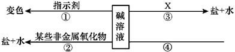

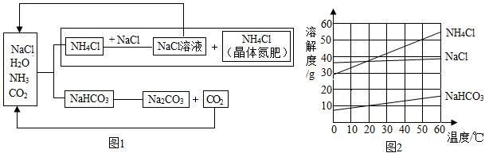

**答案：** （1）碱与盐反应生成新碱和新盐红澄清的石灰水变浑浊酸NaOH+HCl＝NaCl+H2OH++OH﹣＝H2OOH﹣

---

### TK-C9-U10-022
| 字段 | 内容 |
|------|------|
| 章节 | 第十单元-常见的酸碱盐 |
| 来源 | 中考同步+一轮讲义 |
| 题型 | 填空题 |

**题目：** 将稀盐酸慢慢滴入装有氢氧化钠溶液的烧杯中，用温度计测出烧杯中溶液的温度，溶液温度随加入稀盐酸的质量而变化如图所示：由图可知，稀盐酸与氢氧化钠溶液发生的反应是(填“放热”或“吸热”)反应。从 A 到 B 过程中，烧杯中溶液的 pH 逐渐。点时恰好完全反应，C  点的溶液中含有的溶质为。如图是氢氧化钠溶液与稀盐酸恰好完全反应的微观示意图，由此得出该反应的实质是。写出另一个符合该反应实质的化学方程式。

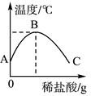

**答案：** （1）放热（2）减小（3）B氯化钠还有氯化氢（4）H+和 OH-结合生成 H2O 分子HCl+KOH==KCl+H2O

---

### TK-C9-U10-023
| 字段 | 内容 |
|------|------|
| 章节 | 第十单元-常见的酸碱盐 |
| 来源 | 中考同步+一轮讲义 |
| 题型 | 填空题 |

**题目：** 在《探究酸、碱的化学性质》实验课上，某同学向盛有约 2mL 氢氧化钠溶液的试管中滴加稀硫酸，没有观察到现象。请教老师后，他发现自己在滴加稀硫酸前忘了加入酸碱指示剂，导致无法判断反应情况，于是他对试管中溶液的中和程度进行探究。（探究目的）探究试管中溶液的中和程度。（实验原理）试管中发生反应的化学方程式为。（做出猜想）猜想 l：氢氧化钠未完全反应，溶液呈碱性。猜想 2：氢氧化钠和硫酸恰好完全反应，·溶液呈中性。猜想 3：氢氧化钠完全反应、硫酸过量，溶液呈酸性。（进行实验）实验操作实验现象实验结论另用试管取该溶液 1～2mL，滴入 1～2 滴无色酚酞溶液，振荡溶液变溶液呈碱性溶液不变色溶液呈酸

**答案：** 2NaOH+H2SO4＝Na2SO4+2H2O红色3NaOH+FeCl3＝Fe（OH）3↓+3NaCl＜Zn+H2SO4＝ZnSO4+H2↑

---

### TK-C9-U10-024
| 字段 | 内容 |
|------|------|
| 章节 | 第十单元-常见的酸碱盐 |
| 来源 | 中考同步+一轮讲义 |
| 题型 | 计算题 |

**题目：** 某实验小组的同学完成“二氧化碳的实验室制取与性质”实验活动后，测得实验产生的废液 pH<6.5（已知：酸、碱废液 pH 在 6.5-85 之间达到排放标准）。为准确测得废液中氯化氢的质量分数，同学们取了 200g 废液，当加入 1.48g 熟石灰时，测得溶液 pH=7。计算废液中氯化氢的质量分数。实验室的这类废液不要倒入下水道，应该（写一条）。

**答案：** （1）0.73%；（2）倒入指定容器，集中处理

---

### TK-C9-U10-025
| 字段 | 内容 |
|------|------|
| 章节 | 第十单元-常见的酸碱盐 |
| 来源 | 中考同步+一轮讲义 |
| 题型 | 填空题 |

**题目：** 在用稀盐酸和氢氧化钠溶液进行中和反应实验时，反应过程中溶液的酸碱度变化如图所示：该实验操作是将滴加到另一种溶液中。当加入溶液的质量为 a g 时，所得溶液中的溶质为（写化学式）。当加入溶液的质量为 bg  时，向所得溶液中滴加酚酞溶液，溶液呈色。氢氧化钠溶液与稀盐酸发生中和反应时观察不到明显现象，为了确定其反应是否发生，某班同学设计了不同的实验方案进行探究。方案一：向装有一定量氢氧化钠溶液的烧杯中滴几滴酚酞试液，不断滴入稀盐酸，并用玻璃棒搅拌。如果实验现象是 就可以证明氢氧化钠溶液与稀盐酸发生了化学反应；方案二：向装有一定量稀盐酸的试试管中滴加氢氧化钠溶液，振荡后再向其中滴加碳酸钠溶液，

**答案：** （1）氢氧化钠NaCl、HCl红溶液由红色变为无色不正确因为可能盐酸有剩余

---

### TK-C9-U10-026
| 字段 | 内容 |
|------|------|
| 章节 | 第十单元-常见的酸碱盐 |
| 来源 | 中考同步+一轮讲义 |
| 题型 | 填空题 |

**题目：** 某化学兴趣小组在实验室取用 NaOH 溶液时，发现瓶口有白色粉末状物质，该小组质疑该 NaOH 溶液可能已变质，于是进行了如下探究：【猜想与假设】猜想Ⅰ．没有变质Ⅱ．部分变质Ⅲ．完全变质溶液中溶质NaOHNaOH、Na2CO3Na2CO3【探究过程】取一定量的该 NaOH 溶液，加入足量的，有气泡产生，说明猜想Ⅰ不成立。产生气泡的化学方程式为。重新取一定量的该 NaOH 溶液，加入足量的 CaCl2 溶液，观察到的现象为。接下来的实验操作及观察到的现象是：，则说明猜想Ⅱ成立。若将 CaCl2 溶液换为 Ca（OH）2 溶液是否可行，判断并简述理由：。【结论与反思】NaOH 易与空气中的

**答案：** （1）盐酸（或稀硫酸）；Na2CO3+2HCl＝2NaCl+H2O+CO2↑（或 Na2CO3+H2SO4＝Na2SO4+H2O+CO2↑）；（2）有白色沉淀生成；再加入无色酚酞试液，观察到溶液液变红色；不可行，若将 CaCl2溶液换为 Ca（OH）2 溶液，会引入氢氧根离子，干扰 NaOH 的检验，无法确定原溶液中是否含有 NaOH。28、【答案】（1）蒸馏水；（2）有气泡产生；（3）有白色沉淀生成，且溶液变红色； Na2CO3+Ca（OH）2═CaCO3↓+2NaOH；（4）CaCl2 溶液 或 BaCl2 溶液； 10% NaOH溶液； 标签贴向手心，防止标签损毁。

---

### TK-C9-U10-027
| 字段 | 内容 |
|------|------|
| 章节 | 第十单元-常见的酸碱盐 |
| 来源 | 中考同步+一轮讲义 |
| 题型 | 填空题 |

**题目：** 有一瓶标签受损、没盖瓶盖且装有无色液体的试剂瓶，如图所示。老师告诉大家，瓶内原有的液体只能是碳酸钠溶液、氢氧化钠溶液、氯化钠溶液、蒸馏水中的一种。为了判断瓶内是何种溶质，并确定试剂瓶的标签，化学小组的同学进行了如下探究活动。【实验探究】从受损的标签信息看，大家一致认为该液体不可能是。甲同学设计了如下方案进行探究。实验操作实验现象实验结论取适量瓶内液体加入试管中，滴加足量的稀盐酸该液体是碳酸钠溶液乙同学认为甲同学的结论不准确，又设计了如下方案进行探究。实验操作实验现象实验结论取适量瓶内液体加入试管中，该液体中的溶质为氢氧化钠和碳酸滴加过量 Ca（OH）2 溶液。静钠。反应的化学方程式：置后

**答案：** （1）Na2CO3（合理即可）；Fe+H2SO4═FeSO4+H2↑；CO2+Ca（OH）2═CaCO3↓+H2O；黑色粉末溶解，溶液变蓝色；⑥⑨；①。

---

### TK-C9-U10-028
| 字段 | 内容 |
|------|------|
| 章节 | 第十单元-常见的酸碱盐 |
| 来源 | 中考同步+一轮讲义 |
| 题型 | 填空题 |

**题目：** 化学课后，某班同学在整理实验桌时，发现有一瓶氢氧化钠溶液没有塞橡皮塞，征得老师同意后，开展了以下探究：【提出问题 1】该氢氧化钠溶液是否变质了呢？【实验探究 1】实验操作实验现象实验结论取少量该溶液于试管中，向溶液中滴加稀盐酸，并不断振荡．．氢氧化钠溶液一定变质了．【提出问题  2】该氢氧化钠溶液是全部变质还是部分变质呢？【猜想与假设】猜想 1：氢氧化钠溶液部分变质．猜想 2：氢氧化钠溶液全部变质．【查阅资料】氯化钙溶液呈中性．氯化钙溶液能与碳酸钠溶液反应：CaCl2+Na2CO3=CaCO3↓+2NaCl【实验探究 2】实验步骤实验现象实验结论①取少量该溶液于试管中，向溶液中滴加过量的

**答案：** （1）出现气泡；（2）白色沉淀；氢氧化钠；部分；（3）CO2+2NaOH=Na2CO3+H2O；不可行；（4）浓盐酸

---

### TK-C9-U10-029
| 字段 | 内容 |
|------|------|
| 章节 | 第十单元-常见的酸碱盐 |
| 来源 | 中考同步+一轮讲义 |
| 题型 | 填空题 |

**题目：** SO 2 等易挥发的弱酸的酸根不能大量共存，如: CO32- +2H+=== CO2↑+H2O; HCO32- + H+=== CO2↑+H2O。33

**答案：** （1）气泡（2）CO32-（3）H2SO4+BaCl2═BaSO4↓+2HCl（4）氢氧根离子与氢离子结合生成了水分子（5）H+（6）BaCl2

---

### TK-C9-U10-030
| 字段 | 内容 |
|------|------|
| 章节 | 第十单元-常见的酸碱盐 |
| 来源 | 中考同步+一轮讲义 |
| 题型 | 选择题 |

**题目：** 某 pH=12 的无色溶液中大量存在的离子有 Na+、Ba2+、NO -、X，则 X 可能是（）3A.Cu2+B.Cl-C.H+D.SO

**答案：** B

---

### TK-C9-U10-031
| 字段 | 内容 |
|------|------|
| 章节 | 第十单元-常见的酸碱盐 |
| 来源 | 中考同步+一轮讲义 |
| 题型 | 选择题 |

**题目：** 小陈在探究氯化钙的性质，进行图甲所示的实验。 试验后，他向反应后的溶液中逐滴滴加碳酸钠溶液，溶液 pH 的变化如图所示，下列分析正确的是（）A．图甲中实验仪器操作无误B．图乙中 d﹣m 段反应过程中有沉淀产生C．图乙中 m﹣n 段反应过程中有气泡产生D．图乙中 n 点之后溶液中的溶质有 Na2CO3 和 NaCl

**答案：** A

---

### TK-C9-U10-032
| 字段 | 内容 |
|------|------|
| 章节 | 第十单元-常见的酸碱盐 |
| 来源 | 中考同步+一轮讲义 |
| 题型 | 填空题 |

**题目：** 某兴趣小组发现一袋腌制松花蛋的泥料，配料表上的成分是氧化钙、纯碱和食盐。他们要探究在腌制松花蛋过程中都有哪些物质对鸭蛋起作用。于是取少量泥料在水中溶解，充分搅拌后过滤，取滤液探究其成分。（猜想与假设）他们都认为滤液中一定有 NaCl 和 NaOH。生成氢氧化钠的化学方程式为。对其他成分他们分别做出了如下猜想：小亮猜想：还可能有 Na2CO3小强猜想：还可能有 Ca(OH)2 和 Na2CO3你认为谁的猜想是错误的，理由是。你还能做出的猜想是：还可能有。现象及相应结论实验步骤（活动与探究）小亮取一定量的滤液于试管中，向其中滴加了几滴稀盐酸，振荡，没有气泡，于是他得出结论：没有 Na2CO3

**答案：** （猜想与假设）Ca(OH)2 + Na2CO3 == CaCO3↓+ 2NaOH小强Na2CO3 和 Ca(OH)2 不能共存Ca(OH)2（活动与探究）碳酸钠Ca(OH)2若不产生白色沉淀(其他合理答案也可)（实验反思）滴加盐酸量很少，在氢氧化钠未反应完之前，不会产生气泡

---

### TK-C9-U10-033
| 字段 | 内容 |
|------|------|
| 章节 | 第十单元-常见的酸碱盐 |
| 来源 | 中考同步+一轮讲义 |
| 题型 | 填空题 |

**题目：** 为除去粗盐中混有的泥沙，某学习小组按以下步骤进行实验：（实验环境温度为  20℃） Ⅰ、称量与溶解Ⅱ、过滤Ⅲ、请回答下列问题：将步骤Ⅲ补充完整。下图中图 1 为氯化钠的溶解度曲线，图 2 为步骤Ⅰ中的部分操作：①由图 1 给出的信息可知：20℃时，NaCl 的溶解度是g。②从节约能源和提高产率的角度分析，图 2  中所需水的最佳体积是mL。（提示：水的密度为 1g﹒mL-1；产率=精盐质量×100%）粗盐质量③用玻璃棒搅拌的目的是。过滤时，若漏斗中的液面高于滤纸的边缘，造成的后果是（填字母）。a、过滤速度慢 b、滤纸破损c、部分杂质未经过滤进入滤液

**答案：** 蒸发36.05加速固体溶解（其他合理答案均可）c

---

### TK-C9-U10-034
| 字段 | 内容 |
|------|------|
| 章节 | 第十单元-常见的酸碱盐 |
| 来源 | 中考同步+一轮讲义 |
| 题型 | 填空题 |

**题目：** 酸、碱、盐在生产和生活中有广泛的应用。焙制糕点所用发酵粉中含有碳酸氢钠，其俗名为(填字母代号)。a．纯碱b．烧碱c．苏打d．小苏打下图是氢氧化钠溶液与硫酸反应时溶液 pH 变化的示意图。①根据图示判断，该实验是将(  填“氢氧化钠溶液”或“硫酸”)滴加到另一种溶液中。②滴入溶液体积为 V2 mL 时，溶液中的溶质为。为除去粗盐水中的可溶性杂质  MgSO

**答案：** （1）d（2）①硫酸②Na2SO4和H2SO4（3）①漏斗②MgSO4＋Ba(OH)2＝Mg(OH)2↓＋BaSO4↓③NaOH和Na2CO3（4）75%

---

## 题目数量统计
| 来源 | 题目数 |
|------|--------|
| 中考同步+一轮讲义 | 34 |
| 合计 | 34 |
