# 第四单元-自然界的水 — 题库

> 来源：中考化学同步+一轮讲义 | 标注格式：TK-C9-U4-题序号

---

### TK-C9-U4-001
| 字段 | 内容 |
|------|------|
| 章节 | 第四单元-自然界的水 |
| 来源 | 中考同步+一轮讲义 |
| 题型 | 选择题 |

**题目：** 水是地球上最普通、最常见的物质之一，下列有关水的说法正确的是() A．淡水资源取之不尽，无需节约B．水是一种常见的溶剂C．大量使用农药、化肥对水体无污染D．矿泉水中只含有水分子，不含其他粒子

**答案：** B.

---

### TK-C9-U4-002
| 字段 | 内容 |
|------|------|
| 章节 | 第四单元-自然界的水 |
| 来源 | 中考同步+一轮讲义 |
| 题型 | 选择题 |

**题目：** 水是生命之源。成市生活用水经自来水厂净化处理的过程如下图。下列说法错误的是A．通过反应沉淀池、过滤池除去水中不溶性杂质 B．吸附池内常用活性炭吸附色素和异味C．自来水厂投入明矾进行消毒D．硬度较高的自来水，用户可用煮沸的方法来降低其硬度
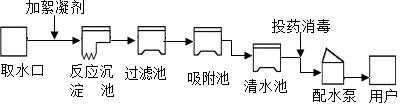

**答案：** C

---

### TK-C9-U4-003
| 字段 | 内容 |
|------|------|
| 章节 | 第四单元-自然界的水 |
| 来源 | 中考同步+一轮讲义 |
| 题型 | 选择题 |

**题目：** 下列有关水的叙述正确的是()A．煮沸可以使硬水软化B．地球表面淡水资源非常丰富C．水可以溶解任何物质D．明矾净水的作用是杀菌消毒

**答案：** A.

---

### TK-C9-U4-004
| 字段 | 内容 |
|------|------|
| 章节 | 第四单元-自然界的水 |
| 来源 | 中考同步+一轮讲义 |
| 题型 | 选择题 |

**题目：** 自来水厂净水过程示意图如图，下列说法正确的是A．明矾是一种常用的絮凝剂B．活性炭可长期使用无需更换C．过滤可除去水中杂质离子D．该净水过程可将硬水变为软水
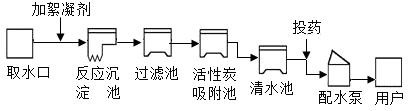

**答案：** A

---

### TK-C9-U4-005
| 字段 | 内容 |
|------|------|
| 章节 | 第四单元-自然界的水 |
| 来源 | 中考同步+一轮讲义 |
| 题型 | 填空题 |

**题目：** 每年的 3 月 22 日是“世界水日”，自来水厂的净水过程中，没有涉及的净水方法是A．蒸馏B．过滤C．吸附D．沉降

**答案：** A

---

### TK-C9-U4-006
| 字段 | 内容 |
|------|------|
| 章节 | 第四单元-自然界的水 |
| 来源 | 中考同步+一轮讲义 |
| 题型 | 填空题 |

**题目：** 下列有关氢气的说法，你认为不．正．确．的是()A.氢气是一种无色、无臭、难溶于水的气体B.氢气在空气中燃烧时，产生淡蓝色火焰C.混有空气或氧气的氢气遇明火一定会发生爆炸D.点燃用排水法收集的一试管氢气，若发出尖锐的爆鸣声，则表明氢气不纯

**答案：** C.

---

### TK-C9-U4-007
| 字段 | 内容 |
|------|------|
| 章节 | 第四单元-自然界的水 |
| 来源 | 中考同步+一轮讲义 |
| 题型 | 选择题 |

**题目：** 正确的实验操作是完成实验任务的保证。下列有关说法中，合理的是（）A．没有检验氢气纯度，就点燃氢气B．加热试管内液体时，切不可让试管口对着人 C．稀释浓硫酸时，将水倒入盛有浓硫酸的烧杯中 D．熄灭酒精灯时，可用嘴吹灭

**答案：** B

---

### TK-C9-U4-008
| 字段 | 内容 |
|------|------|
| 章节 | 第四单元-自然界的水 |
| 来源 | 中考同步+一轮讲义 |
| 题型 | 填空题 |

**题目：** 在电解水的实验中可以直接观察到的现象是() A.水是由氢、氧元素组成的B.有氢气和氧气产生，且体积比为 2∶1C.每个水分子是由两个氢原子和一个氧原子构成D.两电极均冒气泡，a 管内气体与 b 管内气体的体积比约为 2∶1

**答案：** D.

---

### TK-C9-U4-009
| 字段 | 内容 |
|------|------|
| 章节 | 第四单元-自然界的水 |
| 来源 | 中考同步+一轮讲义 |
| 题型 | 选择题 |

**题目：** 下列有关水电解实验的说法正确的是（）A．实验证明水是由氢原子和氧原子组成的B．甲、乙管中气体体积比大于 2：1，可能与两种气体的水溶性有关 C．乙管产生的气体能燃烧，火焰为淡蓝色D．水电解过程中，水分子没有发生变化
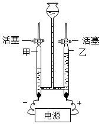

**答案：** B

---

### TK-C9-U4-010
| 字段 | 内容 |
|------|------|
| 章节 | 第四单元-自然界的水 |
| 来源 | 中考同步+一轮讲义 |
| 题型 | 选择题 |

**题目：** 水是生命之源。如图为电解水的实验装置，下列说法正确的是（）A．该实验可用于研究水的组成 B．正极所连的电极上产生的是氢气C．b  中产生的气体可支持燃烧D．实验过程中漏斗内液面高度不变
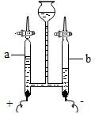

**答案：** A

---

### TK-C9-U4-011
| 字段 | 内容 |
|------|------|
| 章节 | 第四单元-自然界的水 |
| 来源 | 中考同步+一轮讲义 |
| 题型 | 选择题 |

**题目：** 下列是氢气在氧气中燃烧的实验装置，试判断下列操作顺序中正确的是（）A．先通氢气再通氧气，然后点燃 B．先通氧气再通氢气，然后点燃 C．先通氢气，点燃后再通氧气 D．先通氧气，点燃后再通氢气
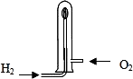

**答案：** C

---

### TK-C9-U4-012
| 字段 | 内容 |
|------|------|
| 章节 | 第四单元-自然界的水 |
| 来源 | 中考同步+一轮讲义 |
| 题型 | 选择题 |

**题目：** 下列物质属于氧化物的是（）A．O2B．P2O5C．H2CO3D．KClO3

**答案：** B

---

### TK-C9-U4-013
| 字段 | 内容 |
|------|------|
| 章节 | 第四单元-自然界的水 |
| 来源 | 中考同步+一轮讲义 |
| 题型 | 选择题 |

**题目：** 下图是表示物质分子的示意图．图中和分别表示两种含不同质子数的原子，图中表示化合物的是（）A．B．C．D．
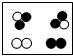

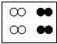

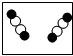

**答案：** D

---

### TK-C9-U4-014
| 字段 | 内容 |
|------|------|
| 章节 | 第四单元-自然界的水 |
| 来源 | 中考同步+一轮讲义 |
| 题型 | 选择题 |

**题目：** 下列各组物质按单质、氧化物、混合物的顺序排列的是（）A．氮气、氨气、空气  B．稀有气体、干冰、液氧C．水银、冰水混合物、石灰水D．水蒸气、蒸馏水、石灰水

**答案：** C

---

### TK-C9-U4-015
| 字段 | 内容 |
|------|------|
| 章节 | 第四单元-自然界的水 |
| 来源 | 中考同步+一轮讲义 |
| 题型 | 填空题 |

**题目：** 如图所示是某学生设计的过滤操作装置图，并用装置将浑浊的河水进行过滤。指出图中的错误：①；② ；③。该同学首先将浑浊的河水静置一段时间，然后再过滤，原因是。为了加快过滤速度，该同学用玻璃棒轻轻搅动漏斗内的液体，这种做法的后果是。该学生改正了错误操作后进行过滤，他发现过滤后的液体仍有浑浊现象，请你帮他找出造成此现象的可能原因（回答两种）：① ；② 。
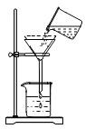

**答案：** 滤纸高于漏斗边缘没有用玻璃棒引流漏斗末端没有紧靠烧杯内壁防止过滤太慢滤纸破损液面高于滤纸边缘滤纸破损（合理即可）

---

### TK-C9-U4-016
| 字段 | 内容 |
|------|------|
| 章节 | 第四单元-自然界的水 |
| 来源 | 中考同步+一轮讲义 |
| 题型 | 填空题 |

**题目：** 小明同学去九仙山旅游时，用瓶装了一些山下的泉水，带回实验室，在老师的指导下，按下列流程进行实验，制取蒸馏水．Ⅰ(1)取水后加人明矾的作用是。进行过滤操作时，下列做法错．误．的是。A．玻璃棒要靠在三层滤纸的一边 B．漏斗下端的管口要紧靠烧杯的内壁 C．滤纸的边缘要低于漏斗口D．液面不要低于滤纸边缘向滤液中加人活性炭，利用其性，除去水样中的色素和异味． (4)在制取蒸馏水的过程中，在水中要放碎瓷片，其作用是。 Ⅱ、周末，小晋同学一家三口到风景秀丽的山区踏青，并准备自制烧烤．爸爸准备了豆腐干、瘦肉、鱼、面包和牛奶，其中豆腐干中含的钙元素属于（填 “常量元素”或“微量元素”）；为使营养均衡，妈妈
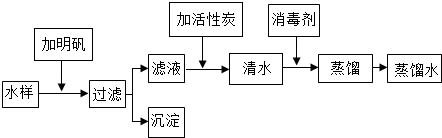

**答案：** Ⅰ（1）利用明矾溶于水后生成的胶状物对杂质的吸附，使杂质沉降来达到净水的目的；D；（3）吸附；（4）防止加热时出现暴沸；Ⅱ（1）常量元素；青菜；（2）增大了木炭与空气的接触面积；（3）硬．

---

### TK-C9-U4-017
| 字段 | 内容 |
|------|------|
| 章节 | 第四单元-自然界的水 |
| 来源 | 中考同步+一轮讲义 |
| 题型 | 填空题 |

**题目：** 蒸馏可降低水的硬度．在实验室可用如图装置制取蒸馏水．回答下列问题：写出下列仪器的名称．；b．；c．；d．． (2)得到的蒸馏水在中（填仪器名称）．仔细观察 d 仪器，它起到作用．冷水进入 d 仪器的方向如图所示，如果改为从上端流入，下端流出行不行？（填 “行”或“不行”）．水在（填序号，下同）中由液态变为气态，在中由气态变为液态。
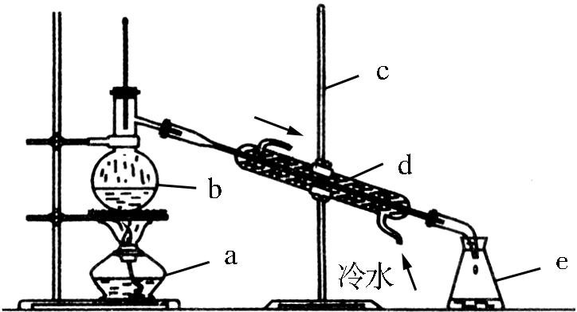

**答案：** (1)酒精灯，蒸馏烧瓶，铁架台，冷凝管；(2)锥形瓶；(3)使水蒸气冷却得到水；不行；(4)b；d.

---

### TK-C9-U4-018
| 字段 | 内容 |
|------|------|
| 章节 | 第四单元-自然界的水 |
| 来源 | 中考同步+一轮讲义 |
| 题型 | 选择题 |

**题目：** 根据右图，回答下列和电解水实验有关的问题：电解水时加入少量稀硫酸或氢氧化钠溶液的目的是  。电解一段时间后，C、D 两试管理论上得到的气体体积比为，C 产生的气体为，C 连接的是电源的，检验的方法：； D 产生的气体为，检验的方法：。反应的文字表达式是。下图是水分子分解的示意图，其中“○”表示氧原子，“●”表示氢原子。 下列关于该反应的说法中，错误的是 。A．水电解后生成氢气和氧气，说明水中含有氢分子和氧分子 B．生成氢分子和氧分子的个数比为 2∶1C．反应前后原子的个数不变 D．反应前后分子的个数不变电解水实验得到的结论：①水是由和组成的；②在化学变化中，分子，而原子。从微观的角度解释
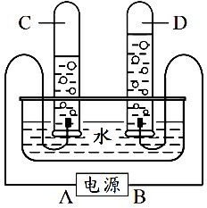

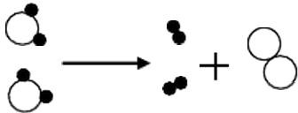

**答案：** （1）增强水的导电性；（2）2∶1；氢气；负极；将燃着的木条放在试管口，观察气体是否被点燃；氧气；把带火星的木条放在试管口，看木条是否复燃；通电水———→氧气＋氢气；（4）AD；（5）氢元素；氧元素；可再分；不可分；通电水电解是水分子分解生成氢分子和氧分子，分子本身发生了变化，属于化学变化；水蒸发是水分子受热，分子间距离增大，分子本身没有发生变化，属于物理变化；来源广，热值高，无污染；水分子；物理；化学；有无新物质生成；分解反应。

---

### TK-C9-U4-019
| 字段 | 内容 |
|------|------|
| 章节 | 第四单元-自然界的水 |
| 来源 | 中考同步+一轮讲义 |
| 题型 | 填空题 |

**题目：** 水是一种宝贵的自然资源。“认识水、珍惜水、节约水、爱护水”是每个公民应尽的义务和责任。①用如图所示装置电解水，玻璃管 a 端连接电源的极，该实验能说明水是由组成。②使用硬水会给生活和生产带来许多麻烦，生活中常用的方法来降低水的硬度。净水器中经常使用活性炭，主要是利用活性炭的性。③我国淡水资源并不丰富，节约用水是爱护水资源的一种途径，请写出节约用水的一种具体做法 。
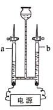

**答案：** 负氢元素和氧元素煮沸吸附淘米水浇花（合理即可）

---

## 题目数量统计
| 来源 | 题目数 |
|------|--------|
| 中考同步+一轮讲义 | 19 |
| 合计 | 19 |
