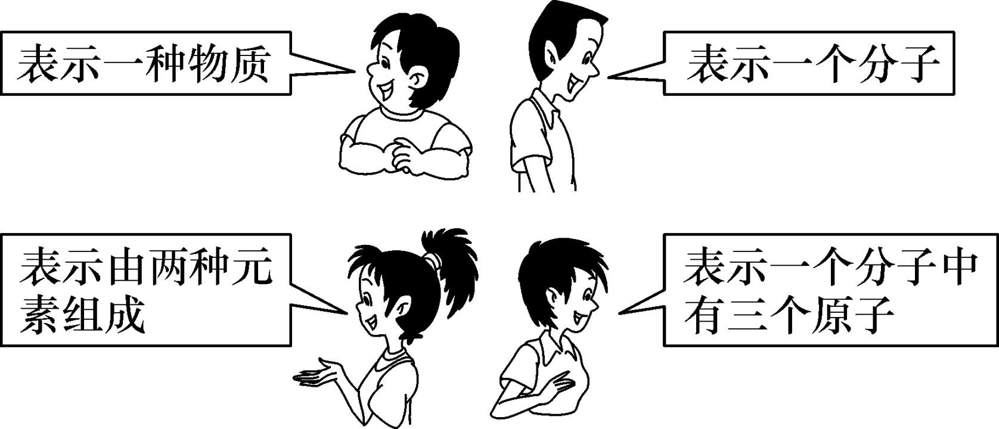
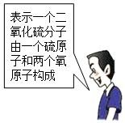
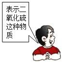
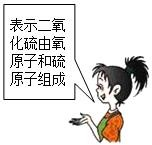
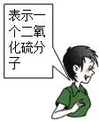
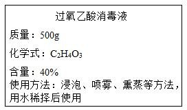

# 第四单元（下）-化学式与化合价 — 题库

> 来源：中考化学同步+一轮讲义 | 标注格式：TK-C9-U4B-题序号

---

### TK-C9-U4B-001
| 字段 | 内容 |
|------|------|
| 章节 | 第四单元（下）-化学式与化合价 |
| 来源 | 中考同步+一轮讲义 |
| 题型 | 选择题 |

**题目：** 下列化学用语书写正确的是（）A．氮气 N2B．氯离子 Cl1-C．铝元素 ALD．1 个氢分子 2H

**答案：** A

---

### TK-C9-U4B-002
| 字段 | 内容 |
|------|------|
| 章节 | 第四单元（下）-化学式与化合价 |
| 来源 | 中考同步+一轮讲义 |
| 题型 | 选择题 |

**题目：** 下面是萌萌同学的一次化学用语练习的部分内容，其中正确的是（）-3A．氦气：He2B．硝酸铵中－3 价氮元素： N H4 NO3C．N2：两个氮原子D．2Fe2+：两个铁离子

**答案：** B

---

### TK-C9-U4B-003
| 字段 | 内容 |
|------|------|
| 章节 | 第四单元（下）-化学式与化合价 |
| 来源 | 中考同步+一轮讲义 |
| 题型 | 选择题 |

**题目：** 尿素的化学式是  CO（NH2）2。下列有关说法正确的是（）尿素由四种元素组成尿素的相对分子质量为 60g尿素由 1 个碳原子、4 个氢原子、1 个氧原子和 2 个氮原子构成尿素中碳元素的质量分数最大

**答案：** A

---

### TK-C9-U4B-004
| 字段 | 内容 |
|------|------|
| 章节 | 第四单元（下）-化学式与化合价 |
| 来源 | 中考同步+一轮讲义 |
| 题型 | 选择题 |

**题目：** 下列各组元素，元素符号的第一个字母相同，且都属于金属元素的是（） A．镁、锌、锰B．铝、金、银C．氮、氖、钠D．氯、钙、铜

**答案：** B.

---

### TK-C9-U4B-005
| 字段 | 内容 |
|------|------|
| 章节 | 第四单元（下）-化学式与化合价 |
| 来源 | 中考同步+一轮讲义 |
| 题型 | 填空题 |

**题目：** 如图，这四位同学描述的是同一个化学符号，此化学符号是()A．NH3B．CO2C．HClD．N2

**答案：** B.

---

### TK-C9-U4B-006
| 字段 | 内容 |
|------|------|
| 章节 | 第四单元（下）-化学式与化合价 |
| 来源 | 中考同步+一轮讲义 |
| 题型 | 选择题 |

**题目：** 下列含氮化合物中，氮元素化合价由低到高排列的一组是（）A.NH

**答案：** A.

---

### TK-C9-U4B-007
| 字段 | 内容 |
|------|------|
| 章节 | 第四单元（下）-化学式与化合价 |
| 来源 | 中考同步+一轮讲义 |
| 题型 | 选择题 |

**题目：** 某款锂电池中含有碳酸乙烯酯（C3H4O3）。下列有关碳酸乙烯酯的说法正确的是（）A．碳酸乙烯酯中含有 O3B．碳酸乙烯酯的相对分子质量是 88gC．碳酸乙烯酯由碳、氢、氧三种元素组成D．碳酸乙烯酯由 3 个碳原子、4 个氢原子和 3 个氧原子构成

**答案：** C

---

### TK-C9-U4B-008
| 字段 | 内容 |
|------|------|
| 章节 | 第四单元（下）-化学式与化合价 |
| 来源 | 中考同步+一轮讲义 |
| 题型 | 选择题 |

**题目：** 下列同学对二氧化硫化学式“SO2”的认识中，不正确的是（）A．  B．    C．  D．

**答案：** B

---

### TK-C9-U4B-009
| 字段 | 内容 |
|------|------|
| 章节 | 第四单元（下）-化学式与化合价 |
| 来源 | 中考同步+一轮讲义 |
| 题型 | 选择题 |

**题目：** 氯酸钾（KClO3）是实验室制取氧气常用药品。氯酸钾中氯元素的化合价为（）A． +2B． +3C． +4D． +5

**答案：** D

---

### TK-C9-U4B-010
| 字段 | 内容 |
|------|------|
| 章节 | 第四单元（下）-化学式与化合价 |
| 来源 | 中考同步+一轮讲义 |
| 题型 | 选择题 |

**题目：** 元素 R 在化合物中只有一种化合价，其氧化物的化学式为 R2O3，则下列化学式中正确的是（）A.R（OH）2B.RNO3C.R2（SO4）3D.RCO311、2020 年我国在抗击新冠肺炎战役中取得了阶段性重大成果。为防控疫情，通常在公共场所使用 84 消毒液（主要成分是 NaClO）进行消毒。NaClO 中氯元素的化合价是（）A． -1B． 0C． +1D． +5

**答案：** C.

---

### TK-C9-U4B-011
| 字段 | 内容 |
|------|------|
| 章节 | 第四单元（下）-化学式与化合价 |
| 来源 | 中考同步+一轮讲义 |
| 题型 | 计算题 |

**题目：** N（NO2）3   是科学家发现的一种新型火箭燃料．试计算：1 个 N（NO2）3分子中含个原子．N（NO2）3  的相对分子质量是．N（NO2）3  中氮元素和氧元素的质量比是．（化为最简整数比）N（NO2）3  中氮元素的质量分数是．（精确到 0.1%）

**答案：** (1)10；(2)152；(3)7：12；(4)36.8%.

---

### TK-C9-U4B-012
| 字段 | 内容 |
|------|------|
| 章节 | 第四单元（下）-化学式与化合价 |
| 来源 | 中考同步+一轮讲义 |
| 题型 | 计算题 |

**题目：** 某硝酸铵样品中 NH4NO3 的质量分数为 90%（杂质不含氮）．计算该氮肥样品中氮元素的质量分数．

**答案：** 31.5%.

---

### TK-C9-U4B-013
| 字段 | 内容 |
|------|------|
| 章节 | 第四单元（下）-化学式与化合价 |
| 来源 | 中考同步+一轮讲义 |
| 题型 | 计算题 |

**题目：** 我国科学家屠呦呦由于成功提取出青蒿素，获得了 2015 年诺贝尔生理学或医学奖。青蒿素是治疗疟疾的有效药物，它的使用在全世界“拯救了几百万人的生命”。青蒿素的化学式为 C15H22O5。试计算：青蒿素的相对分子质量为   。青蒿素中碳氧两元素的原子个数比为。15、2020 年新型冠状病毒肆虐全球。过氧乙酸溶液是杀死细菌和病毒的一种有效药剂，某商店出售一种过氧乙酸消毒液，其标签上的部分文字说明如图所示。过氧乙酸由种元素组成。过氧乙酸中碳、氢元素的质量比为。

**答案：** （1）282；（2）3:1。

---

### TK-C9-U4B-014
| 字段 | 内容 |
|------|------|
| 章节 | 第四单元（下）-化学式与化合价 |
| 来源 | 中考同步+一轮讲义 |
| 题型 | 计算题 |

**题目：** 新型冠状肺炎在我国发生后，我省推出防治新冠肺炎的中医药“甘肃方剂”，成效明显。传统中药“金银花”的有效成分“绿原酸”具有抗菌杀毒的作用，其分子式为 C16HxO9。已知绿原酸的相对分子质量为 354，请你计算：C16HxO9 中 x=。“绿原酸”中碳元素和氧元素的质量比为。“绿原酸”中氧元素的质量分数是（结果精确到 0.1%）。

**答案：** 18；4:3；40.7%

---

### TK-C9-U4B-015
| 字段 | 内容 |
|------|------|
| 章节 | 第四单元（下）-化学式与化合价 |
| 来源 | 中考同步+一轮讲义 |
| 题型 | 填空题 |

**题目：** 由 NaHSO

**答案：** （100－1.75a）%.

---

### TK-C9-U4B-016
| 字段 | 内容 |
|------|------|
| 章节 | 第四单元（下）-化学式与化合价 |
| 来源 | 中考同步+一轮讲义 |
| 题型 | 计算题 |

**题目：** 由 CO 和 SO2 组成的混合气体，测得其中碳元素的质量分数是 24%，则该混合气体中硫元素的质量分数是

**答案：** 根据 CO 中碳、氧元素的质量比=12:16 和该混合气体中碳元素的质量分数是 24%，可以计算 CO 中氧元素的质量分数为 32%，SO2 中碳、氧元素的质量比=32:16×2=1:1，再进一步判断该混合气中含 SO2 的质量分数为 44%，该混合气体中硫元素的质量分数是 22%。

---

### TK-C9-U4B-017
| 字段 | 内容 |
|------|------|
| 章节 | 第四单元（下）-化学式与化合价 |
| 来源 | 中考同步+一轮讲义 |
| 题型 | 填空题 |

**题目：** (NH4)2SO

**答案：** （1）-3；+5；（2）7:1:12；（3）与 300kg 的 CO(NH2)2 所含的氮元素质量相等；该(NH4)2SO4 化肥样品(NH4)2SO4 的质量分数 97.1%。常见物质化学式及化合价练习【答案】1.前 20 号元素符号和名称：氢 （H ） 氦（ He ） 碳 （ C ） 氮 （ N ） 氧（ O ） 氟（ F ）氖 （Ne） 钠（ Na ） 镁 （Mg ） 铝 （ Al ） 硅（ Si ） 磷（ P ）硫 （ S ） 氯（ Cl ） 氩 （ Ar ） 钾 （ K ） 钙 （ Ca） 锰 （ Mn ）铁 （ Fe） 铜（Cu ） 锌 （Zn ） 银 （Ag ） 钡（ Ba ）

---

## 题目数量统计
| 来源 | 题目数 |
|------|--------|
| 中考同步+一轮讲义 | 17 |
| 合计 | 17 |
